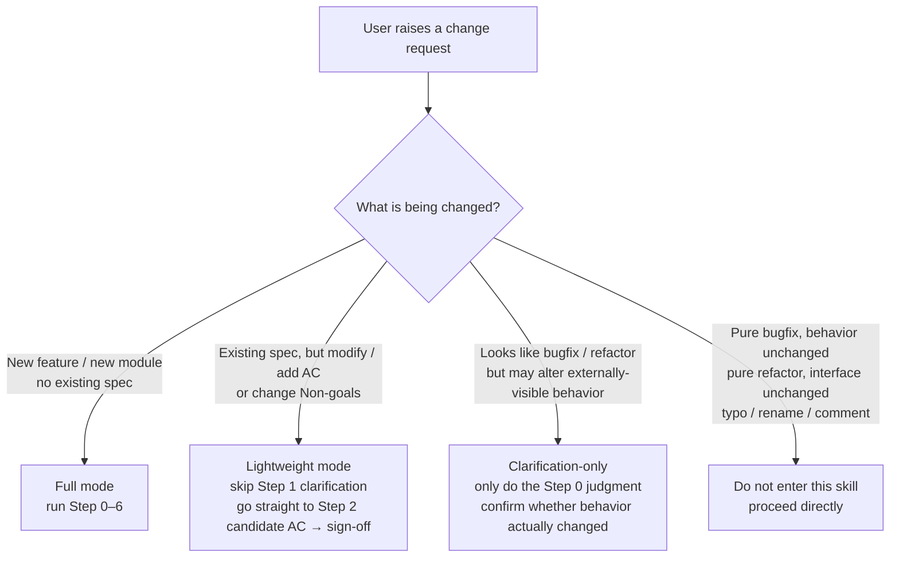
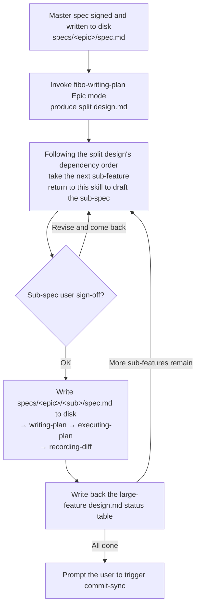

# Fibo brainstorming pre-stage skill

> This skill is the **mandatory pre-stage** before any change that **alters externally-visible behavior / AC / contracts**.
> Goal: align "the user's vague intent" into "a user-signed-off AC list", and **only then** proceed to formally filing or modifying `.fibo/docs/specs/<feature>/spec.md`.

---

## When to use (3-tier trigger)



**Full mode (must run the complete flow)**:
- User says "I want to add an X feature", "we need to do Y", "help me build a Z module"
- User says "I don't know how to do this", "how should this be designed"
- The task requires **creating** a new `.fibo/docs/specs/<feature>/` directory

**Lightweight mode (changing behavior on an existing spec, skip clarification)**:
- **Adding a new AC** / **modifying an existing AC** / **changing Non-goals** on an existing spec
- Making a "behavior tweak" within the scope of an existing spec (e.g. changing a default value, changing an error-handling path)
- → Start directly from Step 2 (candidate AC), continuing the AC numbering off the existing spec's numbers

**Clarification-only (first confirm whether entering this skill is really needed)**:
- User says "just fix a bug" but the description contains "going forward it should…", "I want it to…" (actually a behavior change)
- User says "just refactor" but also changes the external interface / config item / return structure along the way
- → Use **1 multiple-choice question** to clarify: "Will this change alter (A) function signature / return value (B) error messages / error codes (C) config items / default values (D) none of the above".
  - Choose (D) → exit this skill, proceed directly
  - Choose (A)/(B)/(C) → escalate to Lightweight mode and continue

**Scenarios where you do NOT enter this skill**:
- Pure bugfix (behavior unchanged, just fixing what was "wrong" to be right)
- Pure refactor (external interface / AC completely unchanged)
- Single-file single-line typo, comment fix, variable rename
- User is writing an ordinary document (not a spec / design document)

---

## Core principles

1. **No writing code, no touching files, no commit**: this stage only outputs dialogue and a **draft (presented only as a code block, not written to disk)**
2. **Draft does not enter the repo**: before the user signs off, never create / modify `.fibo/docs/specs/<feature>/spec.md`
3. **AC uses EARS syntax**: avoid natural-language ambiguity
4. **One question at a time, multiple-choice preferred**: if you can offer (A)/(B)/(C) options, don't ask open-ended questions
5. **Only ask trade-off questions**: if one candidate is clearly better (matches user intent / is a better design / lower risk), decide it directly, **no need to consult**; only ask the user when a real trade-off exists (each has pros and cons / it affects the AC direction)
6. **Open questions do not enter the spec**: all questions are settled within the dialogue; you **must not** write `Open questions` / `TBD` wording into the on-disk spec.md
7. **Confirm in small chunks**: don't dump the complete spec all at once; go chunk by chunk in the order "scope → intent → AC → boundaries → self-review"
8. **Stop and ask when something is ambiguous**, don't fill in the blanks for the user

---

## Main flow

```mermaid
flowchart TD
  A[User raises a need] --> S0[Step 0: Scope gate<br/>do we need to split into sub-projects?]
  S0 -->|Too big and user chooses to split| EPIC[Enter large-feature split mode<br/>see Step 0.5: first align the master spec<br/>then run the full chain per sub-feature]
  EPIC --> S1
  S0 -->|Right size| S1[Step 1: Clarify intent<br/>single question + multiple-choice preferred ≤ 5 rounds]
  S1 --> S2[Step 2: Candidate AC<br/>EARS syntax + numbering]
  S2 --> S3[Step 3: Boundaries and Non-goals]
  S3 --> S4[Step 4: Resolve trade-off questions in dialogue<br/>discussed only in dialogue, settled once discussed<br/>does not enter the spec]
  S4 --> S5[Step 5: Draft spec skeleton<br/>shown only in dialogue]
  S5 --> S55[Step 5.5: Pre-disk self-review<br/>run self-review checklist<br/>stay silent if it passes]
  S55 -->|Issue found| S2
  S55 -->|Passed| S6{Step 6: User sign-off?}
  S6 -->|Revise and come back| S2
  S6 -->|Cancel| END[Terminate]
  S6 -->|Explicit OK / approved / go| DONE[Auto-chain:<br/>write spec.md to disk →<br/>invoke fibo-writing-plan →<br/>invoke fibo-executing-plan<br/>until all tasks [√]]
```

---

## Step 0: Scope gate (first judge whether a split is needed)

**Signals that trigger a split** (propose a split if any one is met):
- The one-sentence need contains ≥ 2 **independent subsystems** (e.g. "build a platform with chat, file storage, and billing")
- It involves ≥ 3 independent actors (developer + end user + third-party system + admin…)
- The implementation path spans ≥ 2 existing modules with no obvious reuse relationship between them

**How to propose**: use a single multiple-choice question; don't start asking details first.

> Example:
> "This need appears to cover three parts: [subsystem A], [subsystem B], [subsystem C]; a split is recommended. Please choose:
> (A) Go with large-feature split mode: create `specs/<epic>/` (master spec + split design), with each sub-feature having its own subdirectory running the full chain — recommended (independently verifiable, low risk, see Step 0.5)
> (B) Merge into 1 large feature, with subsystems as AC groups — suitable when the three are tightly coupled
> (C) Let me think more; for now focus on the [X] part"

**Do not enter Step 1** before scope is aligned, to avoid tearing down an entire spec later.

---

## Step 0.5: Large-feature split mode (entered after the user chooses to split in Step 0)

> Source of truth for directory structure and identification rules: `fibo-conventions/references/conventions/docs-system.md` §3.1.
> This step only defines the behavioral difference of the brainstorming stage; the on-disk conventions follow that file.

**In this mode, the subject of Steps 1–6 is the "master spec"**, differing from an ordinary feature as follows:

| Aspect | Ordinary feature | Large-feature master spec |
| --- | --- | --- |
| AC granularity | Can go directly down to implementation | **High-level AC** (describes end-to-end verifiable results, not bound to implementation details) |
| Extra sections | None | Must include `## Sub-feature boundary`: list each sub-feature's name (lowercase hyphenated English) + a one-sentence responsibility + its parent master AC |
| On-disk location after sign-off | `specs/<feature>/spec.md` | `specs/<epic>/spec.md` |
| Chaining after sign-off | `fibo-writing-plan` produces design + plan | `fibo-writing-plan` **Epic mode**: produces only the split design.md, **not plan.md** |

**Chaining order after the master spec is signed off**:



**Iron rules**:

- **Each sub-feature's spec must be signed off individually** (Q1-A decision): the master spec sign-off ≠ authorization to auto-generate all sub-specs; each sub-spec draft must run through Steps 2–6 of this skill (starting from Lightweight: the master spec has already set the boundaries, so skip Step 1 clarification)
- The sub-spec's AC is renumbered from `AC-01`, with each entry annotated with its corresponding master AC (e.g. `↑ EPIC AC-02`)
- The sub-feature directory **must be nested** inside `specs/<epic>/`; flattening it into the `specs/` root is forbidden
- Advance only one sub-feature at a time (serially); do not open multiple sub-spec drafts in parallel

---

## Step 1: Clarify intent (one question at a time, multiple-choice preferred)

**Iron rules**:
- Ask only 1 question at a time, **do not flood the screen with 5**
- If you can list options, list options; open-ended questions are only for "add anything else"
- Total rounds ≤ 5 (including follow-ups); exceeding it means the scope isn't aligned → go back to Step 0

**6 candidate questions (pick 1–5 as needed, ask in order)**:

1. **Who**: Who are the users?
   - (A) In-project developers (B) End users (C) CI / automation (D) Other, please specify
2. **Why**: What is the biggest pain of not having it now?
   - (A) Inefficient process (B) Error-prone (C) Not traceable (D) Completely impossible (E) Other
3. **Scope (MVP)**: What **must** the first version include?
   - List 2–3 candidate minimal sets for the user to pick
4. **Existing**: Is there already related code / docs in the project? Is this new or a replacement?
   - (A) Brand new (B) Replaces existing `<old module>` (C) Extends on top of `<existing module>`
5. **Constraints**: Are there deadline / performance / compatibility / third-party dependency constraints?
   - Open-ended (this kind of info can't be enumerated as multiple-choice)
6. **Success**: What counts as "done"? Give one quantifiable criterion.
   - Example: (A) First screen < 2s (B) Error rate < 1% (C) Custom metric, please specify

---

## Step 2: Candidate AC (EARS syntax)

**The five EARS templates**:

| Type | Syntax | Example |
| --- | --- | --- |
| Ubiquitous | `The <system> shall <response>` | "The system shall enforce a meta-info block on all spec.md files." |
| Event-driven | `When <trigger>, the <system> shall <response>` | "When the user clicks the commit button, the system shall perform code commit first." |
| State-driven | `While <state>, the <system> shall <response>` | "While in sync-only mode, the system shall not trigger code commit." |
| Optional feature | `Where <feature>, the <system> shall <response>` | "Where verbose mode is enabled, the system shall output the git command details." |
| Unwanted | `If <trigger>, then the <system> shall <response>` | "If `.fibo/index.json` is missing, the system shall fall back to HEAD-only analysis mode." |

**Numbering convention**:
- Full mode: start from `AC-01`
- Lightweight mode: continue from the existing spec's last AC number (e.g. if AC-07 exists, new ones start from AC-08)

**Points to note**:
- Every AC must be testable and rejectable ("user-friendly" ❌ / "first screen < 2s" ✅)
- One AC, one thing; avoid "the system shall do A and do B"
- Exception / error paths must be explicitly listed (`If ... shall`); do not default to "the happy path is enough"

---

## Step 3: Boundaries and Non-goals (make them explicit)

Fix a `Non-goals` section listing what "is explicitly not being done this time". Example:

```
Non-goals (not this time):
- No support for multi-user concurrent editing (Phase 2)
- No offline mode (relies on the existing online architecture)
- No refactoring of the existing ConfigLoader (only add a layer on the outside)
```

**Why it matters**: to avoid "casual extension" during the later implementation stage that causes the spec ↔ reality to diverge.

---

## Step 4: Resolve trade-off questions in dialogue (**does not enter the spec**)

Settle all questions that "affect AC / design direction" **in this step's dialogue, right when discussed**. You **must not** write an `Open questions` section into the on-disk spec.md (per Core principle #6).

### 4.1 Should you ask? — Decision flow

```mermaid
flowchart TD
  Q[A question arises] --> A{Is there a real trade-off among candidates?}
  A -->|One option is clearly better<br/>matches user intent + better design + lower risk| AUTO[Decide it yourself, implement it in the draft as "chose X, reason Y"]
  A -->|Each has pros and cons / affects AC direction| ASK[Ask the user, see 4.2 format]
```

### 4.2 Format for asking questions

If you must ask, **provide candidates + a one-sentence trade-off + mark the recommended option**. Don't just list `[ ] Q1: …await user decision`.

```
Q1: How to handle a file conflict?
  (A) Overwrite directly — simple, but risks losing data
  (B) Error out and exit — safe, but poor user experience
  (C) Generate a .conflict copy — recommended: balances safety and recoverability
  → Please choose
```

### 4.3 After discussion

- User decided → in the Step 5 draft, reflect it directly as AC / Non-goals / a design decision, **no longer marked "undecided"**
- User says "leave it for Phase 2" → write it into the Non-goals section ("not doing X this time, decide in Phase 2"), likewise **without an Open questions section appearing**
- A genuinely uncertain open point (very rare) → escalate to an ADR (`decisions/`), don't put it in spec.md

---

## Step 5: Draft the spec.md skeleton (shown only in dialogue, not written to disk)

Organize it per the structure of `references/spec.template.md` (maintained by `fibo-conventions`). Minimal skeleton:

```markdown
# {Feature display name}

## 1. Background and goals
(Overview of Who / Why / value / scope)

## 2. Acceptance criteria (AC)
- AC-01 (Event-driven): When ..., the system shall ...
- AC-02 (State-driven): While ..., the system shall ...
- AC-03 (Unwanted): If ..., then the system shall ...
...

## 3. Non-goals

## 4. Implementation location (filled in by reverse sync during the implementation stage after the spec passes)
(Leave empty; filled in by fibo-conventions' reverse-sync flow after the code is written)

---
name: {Feature display name}

update-time: {take the current system time at sign-off, using the sync.md §2.2 command}

description: {a one-sentence description of this feature's goal and scope, for retrieval}

---
```

---

## Step 5.5: Pre-disk self-review checklist (**mandatory**)

Before reporting the draft to the user, run through the table below **yourself** first; if any item is abnormal → go back to Step 2 to fix it:

| # | Check item | Failure example |
| --- | --- | --- |
| C1 | All AC use EARS syntax and are numbered | "supports export" ❌ |
| C2 | Every AC is testable, rejectable, free of subjective words | "friendly" / "reasonable" / "fast" ❌ |
| C3 | One AC describes only one thing | "the system shall do A and B" ❌ |
| C4 | Exception / error paths are explicitly listed (at least 1 `If ... shall`) | all happy path ❌ |
| C5 | The Non-goals section is non-empty | section missing ❌ |
| C6 | **No `Open questions` section in the draft** | leaving "## 4. Open questions" ❌ |
| C7 | **No placeholders / TODO / `<to fill>` / `TBD`** in the draft | "AC-03: <todo>" / "TBD" ❌ |
| C8 | AC and Non-goals do not contradict | AC-02 says "supports X" while Non-goals says "won't do X" ❌ |
| C9 | Scope is still within the range agreed in Step 0 (no bloat) | Step 0 said focus on subsystem A, but AC contains B's features ❌ |
| C10 | The meta-info block has all three elements (name / update-time / description placeholder) | missing a field ❌ |

**Passed → silently send the draft for the user to see**; **do not** report the passing checklist items back (the user doesn't need to know the self-review process).
**Any failure → silently rework**, running it repeatedly until all pass; don't send a "half-baked draft + self-review failure note" together.

---

## Step 6: Wait for sign-off

Tell the user explicitly: "The above is the spec draft; please confirm / revise / reject."

**Only when the user explicitly says "OK / approved / go" do you proceed to the next step.**
**Do not treat "the user did not object" as "the user agreed".**

After sign-off passes, **auto-chain execution** (no need to ask the user again, no need for the user to manually trigger between stages):
1. Invoke the `fibo-conventions` skill to get the on-disk / meta-info conventions
2. Actually create / update `spec.md` under `.fibo/docs/specs/<feature-slug>/` (write the just-drafted content to disk, with the meta-info block `update-time` now taking the current system time; for the command, see `fibo-conventions` §"getting system time cross-OS")
3. **Immediately invoke the `fibo-writing-plan` skill**: read the just-written spec.md → produce design.md + plan.md
4. **Immediately after plan.md is written, invoke the `fibo-executing-plan` skill**: implement task by task serially until all are `[√]`
5. When execution wraps up, output an "implementation complete" report and prompt the user to actively trigger commit-sync (commit-sync is still user-triggered, not run automatically)

> **Do not stop between stages to ask "should we proceed to the next step"** — the user's single sign-off at Step 6 = authorization to run the full spec → design → plan → implementation chain. Only stop in the following cases:
> - `fibo-writing-plan` Step 4 self-review fails (AC coverage incomplete / out of bounds)
> - `fibo-executing-plan` a single task fails (offer the three options a/b/c)
> - The user explicitly calls a halt during the chaining

---

## Mandatory constraints

- ❌ Do not `Write` any file under `.fibo/docs/specs/...` before the user signs off
- ❌ Do not write any business code / tests / config at this stage
- ❌ Do not do a git commit at this stage
- ❌ Do not casually ask the user: when a candidate has an obvious winner, decide directly; **only ask when a real trade-off exists**
- ❌ Do not write an `Open questions` section into the on-disk spec.md — all questions are settled in the Step 4 dialogue
- ❌ Do not dump the complete spec in one go — confirm chunk by chunk (scope → intent → AC → boundaries → self-review)
- ❌ Do not ask more than 1 question at a time; do not ask ≥ 5 open-ended questions at once
- ❌ Do not skip the Step 5.5 self-review and show the draft to the user directly
- ❌ After Step 5.5 passes, **do not** report the passing checklist items to the user (silently let it through)
- ✅ Allowed: show the draft as a code block in the dialogue; use `references/spec.template.md` as a skeleton reference
- ✅ Allowed: list options whenever possible; open-ended questions only for "add anything else"

---

## Handoff to `fibo-conventions`

```mermaid
flowchart LR
  A[User new need / behavior change] --> B[fibo-brainstorming]
  B -->|Draft signed off| C[Write spec.md to disk]
  C -->|Auto| D[fibo-writing-plan<br/>produce design.md + plan.md]
  D -->|Auto| E[fibo-executing-plan<br/>implement task by task serially]
  E -->|All [√]| F[Prompt user to trigger commit-sync<br/>user-initiated]
```

**Division of labor**:
- `fibo-brainstorming`: **generate the draft + get the user's sign-off** (deliverable: the spec draft in the dialogue)
- `fibo-conventions`: **all iron rules after writing to disk** (path tags / comments / reverse sync / commit-sync)

Do not mix the stages of the two skills. The "sign-off" action completed by this skill is the prerequisite for `fibo-conventions` to later treat `spec.md` as a "whitelisted sync target".

---
name: Fibo brainstorming pre-stage skill

update-time: 2026-07-08 02:28

description: Conventions for AC clarification, spec-draft sign-off, large-feature splitting, and the entry into subsequent chaining before a behavior change or new feature enters implementation

---
