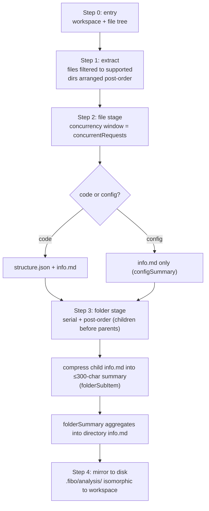

# Fibo code-analysis capability skill (code-analysis)

> This skill reproduces a tiered "**file → structure → folder**" code-analysis capability, letting you produce the same `.fibo/analysis/` mirror artifacts on any codebase.
> This skill is **self-contained** — orchestration logic and all prompts / templates live in this directory and depend on no external project:
> - Pipeline orchestration / concurrency / disk-write rules: `references/pipeline.md`
> - Template-fill DSL / structure-extraction schema: `references/{template-dsl,structure-schema}.md`
> - Full set of prompts / templates (18 files + 1 README index): `references/prompts/` (see its README)
> This file is the **L0 entry / dispatcher**; detailed rules are split into `references/` to avoid loading everything at once.

---

## When to use

✅ Applicable:
- You want to generate structured analysis docs for a codebase (or subdirectory): file summaries / directory summaries / structure skeletons
- You want to understand, rewrite, or extend the project's own "analysis" pipeline (service / tool / prompt selection / concurrency / disk write)
- You want to add a new language's `codeAnalysis.<lang>.prompt.md`, or tune the output quality of some summary

❌ Not applicable:
- You just need to read one file to answer a single question → read it directly, don't spin up the whole pipeline
- Up-front brainstorming for a new feature / new spec → use `fibo-brainstorming` first
- Writing jump-tag / Mermaid node-ID rules → that is governed by `fibo-conventions`' markdown.md (this skill does not duplicate it; reference it directly)

---

## Core mental model (in one sentence)

**Deterministic skeleton + AI semantics + template-DSL fill + tiered aggregation**: tree-sitter extracts structural facts, AI only adds semantic descriptions; output goes through a two-part "`.prompt.md` system instruction + `.template.md` output skeleton" form; files run concurrently, directories run serially in post-order aggregation.

---

## Main flow

> Why files run concurrently while directories run serially in post-order: a parent directory's summary must reference all completed child info.md files, and post-order guarantees children finish before parents; files have no dependencies among them so they can run concurrently (default window 2, from `provider.concurrentRequests`).

---

## Dispatch table (look up "which file to read" by scenario)

| What I'm about to do | Required sub-doc | Key one-liner |
| --- | --- | --- |
| Understand / rewrite the whole pipeline (ordering, concurrency, disk write, prompt-selection fallback) | `references/pipeline.md` | Files concurrent + directories serial post-order; if a language-specific prompt is missing, fall back to `codeAnalysis.prompt.md`, then to `default.prompt.md` |
| Write / modify any `*.template.md`, or have the AI produce output per a template | `references/template-dsl.md` | Five template symbols: `{fill}` `(delete-comment)` `[optional block]` `{A|B choice}` `<tag>replace`; output is uniformly wrapped in `{"result":"..."}` |
| Touch `structure.json` structure extraction (tree-sitter / AI fallback / add descriptions) | `references/structure-schema.md` | Structural facts are fixed by tree-sitter, AI only produces "addressing key → description"; the full-AI fallback uses the `codeAnalysis.<lang>` schema |
| Read / reuse the raw prompts of any stage | `references/prompts/` (18 prompt/template files, see its README) | This directory is authoritative; to add a language, drop in one `codeAnalysis.<lang>.prompt.md` |
| Write code / text / graph jump tags or Mermaid node IDs in the output | `fibo-conventions` → `references/conventions/markdown.md` | This skill does **not** duplicate the tag rules; always defer to markdown.md (`?class=` mandatory, node ID `_NNN` three-digit increment) |

---

## Artifact disk-write cheat sheet

Mirror root: `.fibo/analysis/`, isomorphic to the workspace structure. **Naming is asymmetric**: file artifacts are "suffix siblings", directory artifacts are "child files inside the directory". Full list + content format: see `references/pipeline.md` §5.1.

| Source object | Artifact count | Disk path |
| --- | --- | --- |
| Code file `src/a.ts` | 2 | `.fibo/analysis/src/a.ts.structure.json` + `.fibo/analysis/src/a.ts.info.md` |
| Config file `config/x.json` | 1 | `.fibo/analysis/config/x.json.info.md` (no structure.json) |
| Directory `src/svc/` | 1 | `.fibo/analysis/src/svc/svc.info.md` (file name = basename(directory)) |

---

## prompt vs template (must keep straight)

| Dimension | `*.prompt.md` | `*.template.md` |
| --- | --- | --- |
| Role | **System instruction**: tells the AI how to think, the input/output schema, constraints | **Output skeleton**: the Markdown structure the AI must fill in (includes template-DSL symbols) |
| Loading | Loaded and cached at startup by functionName (`config.systemPrompt`) | Injected **per request** as the `template` field inside the user prompt |
| Count | One per analysis type | One shipped with each LLM call alongside its input |

Which prompt/template each stage uses: see the mapping table in `references/pipeline.md`.

---

## Mandatory constraints

- ❌ Don't let the AI re-"parse structure": structural facts (name / type / line numbers) belong to tree-sitter, the AI only adds descriptions (see structure-schema.md)
- ❌ Don't run the directory stage concurrently: it must be serial + post-order, otherwise parent summaries can't reference child artifacts
- ❌ Don't rewrite jump-tag / Mermaid rules inside this skill: markdown.md is the single source of truth
- ❌ Don't leave template symbols like `{}` `()` `[]` `<tag>` residual in the final artifact
- ✅ Always wrap output JSON in the shell each prompt specifies (`{"result":...}` / FileMeta / `{key:desc}` / `{"summary":...}`)
- ✅ Paths are always relative to the project root and never start with `/` (consistent with markdown.md §2)

---
name: Fibo code-analysis capability skill (code-analysis)

update-time: 2026-07-02 02:59

description: Reproduces the tiered "file→structure→folder" code-analysis capability (self-contained, no external project dependency). Use when producing structured analysis artifacts (structure.json / info.md / directory summaries), or understanding/rewriting the analysis pipeline, prompt selection, concurrency, disk write, or adding a language prompt. info.md artifacts must carry a name/update-time/description meta-info block; jump-tag and Mermaid rules reference fibo-conventions/markdown.md

---
