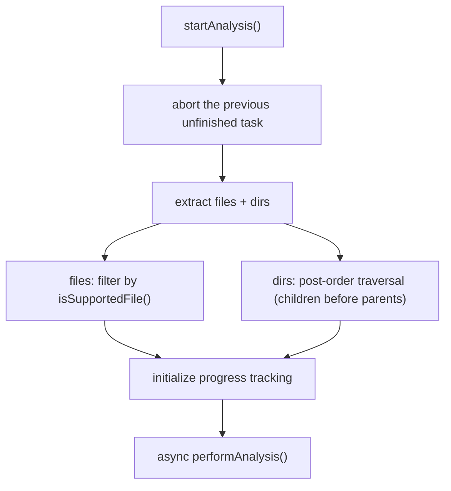
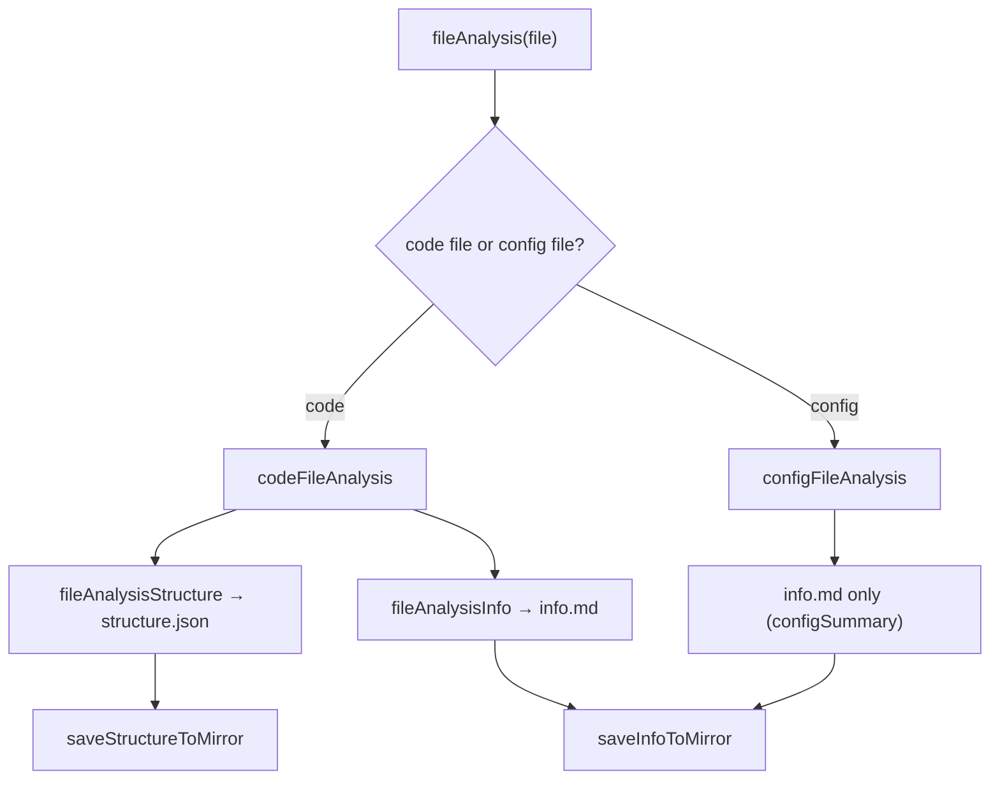
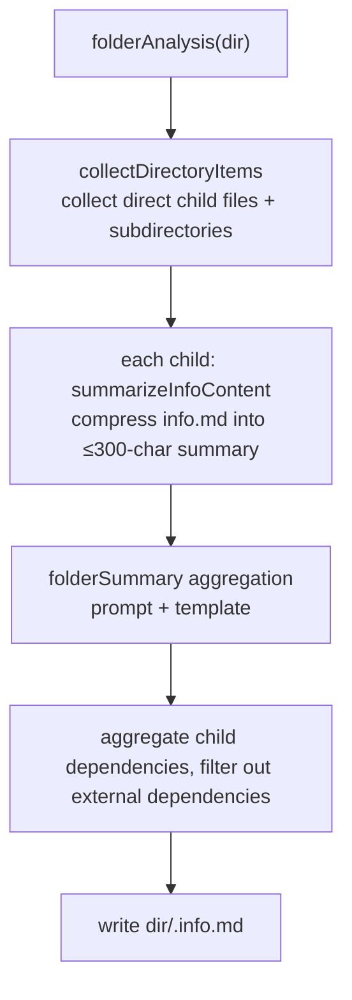
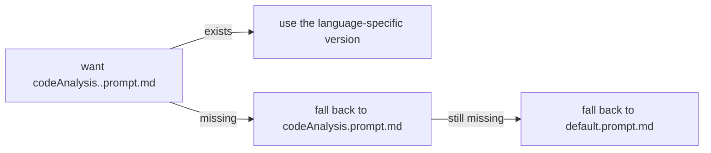
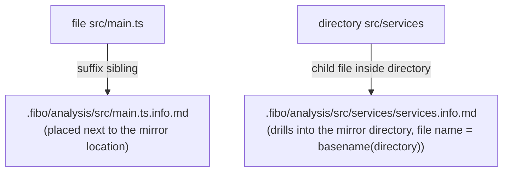

# Analysis pipeline in detail (pipeline)

> This file is part of the `fibo-code-analysis` skill. Read it when **understanding / rewriting the whole analysis pipeline**.
> Source of truth: the body of this file is the pipeline-orchestration description itself, which together with the full set of prompts in `references/prompts/` and `references/{template-dsl,structure-schema}.md` forms the complete capability description.

## 1. Entry and extraction

Trigger: `POST /api/analysis/start` (workspace root + frontend file tree `FileNode`) → `AnalyseService.startAnalysis()`.

- **files**: filtered by `CodeAnalysisTool.isSupportedFile()` to drop unsupported extensions
- **dirs**: arranged in post-order — subdirectories come before their parent directories, which is a precondition for later aggregation
- Progress: only tasks taking ≥ 30s count toward the average-duration and remaining-time estimates; the interruption flag is checked at each task boundary

## 2. File stage (concurrent)

`analyzeConcurrently()`: rolling window + `Promise.race()`, concurrency = `provider.concurrentRequests` (default 2). Each file is routed through `fileAnalysis()`:

- **Code files**: produce `structure.json` (structure skeleton, see structure-schema.md) **and** `info.md` (human-readable summary)
- **Config files**: produce only `info.md`, using `configSummary.prompt.md` + `configSummary.template.md`
- Before file content is fed to the LLM, a **line-number prefix** is added (`1| ...`) so line ranges can be located precisely

## 3. Folder stage (serial + post-order)

`analyzeDirectoriesSequentially()`: processes the post-order list strictly one by one, **not concurrently**.

- Child summaries use `folderSubItem.prompt.md` (output `{"summary":"…≤300 chars"}`), compressing the full `info.md` into the key information fed upward, to avoid context blow-up
- **Why post-order matters**: when processing a parent directory, the `info.md` of all child files / subdirectories is already ready and can be read and aggregated

## 4. prompt / template mapping table

| Stage | functionName | system prompt | output template | output shell |
| --- | --- | --- | --- | --- |
| Code structure (full-AI fallback) | `codeAnalysis` | `codeAnalysis.<lang>.prompt.md` → fall back to `codeAnalysis.prompt.md` | none (produces FileMeta JSON directly) | FileMeta |
| Structure description | `structureDescription` | `structureDescription.prompt.md` | none | `{ "<key>": "<description>" }` |
| File summary | `fileSummary` | `fileSummary.prompt.md` | `fileSummary.template.md` | `{ "result": "<filled md>" }` |
| Directory summary | `folderSummary` | `folderSummary.prompt.md` | `folderSummary.template.md` | `{ "result": "<filled md>" }` |
| Config summary | `configSummary` | `configSummary.prompt.md` | `configSummary.template.md` | `{ "result": "<filled md>" }` |
| Child compression | `folderSubItem` | `folderSubItem.prompt.md` | none | `{ "summary": "<≤300 chars>" }` |

**Prompt selection and fallback** (`config.systemPrompt(functionName, moduleDir, fallback, isTemplate)`):

- Prompt content is cached in memory keyed by `{moduleDir}:{functionName}:{.prompt.md}` (`promptCache`)
- Adding a language: drop in one `codeAnalysis.<lang>.prompt.md` and it gets auto-selected, no orchestration-code change needed

## 5. LLM call and persistence

- Call: `chatTool.chat(systemPrompt, JSON.stringify({fileName, filePath, fileContent, template}), temperature ?? 0.1, maxTokens ?? 8192)`
- Parse: `JsonParserUtil.parseFromResponse()` extracts the corresponding shell field
- Disk write: `saveStructureToMirror()` (JSON) / `saveInfoToMirror()` (md); paths are mapped to `.fibo/analysis/` via `WorkspacePathResolver.getAnalysisDir()`, isomorphic to the workspace
- Failure: `writeErrorToFile()` writes an error placeholder without interrupting the whole run

## 5.1 Exact list of disk artifacts (verified against code-analysis-tool.ts)

Mirror root: `WorkspacePathResolver.getAnalysisDir()` = `<workspaceRoot>/.fibo/analysis/`, isomorphic to the workspace.

| Source object | Artifact count | Disk path | Content format |
| --- | --- | --- | --- |
| Code file `src/main.ts` | **2** | `.fibo/analysis/src/main.ts.structure.json` `.fibo/analysis/src/main.ts.info.md` | structure.json = FileMeta JSON (see structure-schema.md) info.md = fileSummary template fill + structure details + dependency section + `name/update-time/description` meta-info block, ending with `----------` |
| Config file `config/x.json` | **1** | `.fibo/analysis/config/x.json.info.md` | configSummary template: config overview / config-item breakdown (code tag per item) / usage scenarios / config recommendations + `name/update-time/description` meta-info block, ending with `----------` (**no structure.json**) |
| Directory `src/services` | **1** | `.fibo/analysis/src/services/services.info.md` | folderSummary template: key role / code architecture / architecture concept graph (graph, line numbers uniformly = 1) / expert view + file details (text tag per child + ≤300-char summary) + dependency aggregation + `name/update-time/description` meta-info block |

### Naming asymmetry (crucial, easy to get wrong)

- **File artifact = suffix sibling**: `.structure.json` / `.info.md` is appended directly after the mirror path (in the `code-analysis-tool.ts` disk-write functions)
- **Directory artifact = child file inside the directory**: `upath.join(analysisDir, folderPath, \`${basename(folderPath)}.info.md\`)`
- This asymmetry is the root reason `processConceptGraphsInInfo` must assemble `infoPath` on an `isDirectory` branch — when changing disk paths, both branches must change together, and the frontend resolves back by the same rule
- Failure fallback: any stage failure goes through `writeErrorToFile()` to write an error placeholder to the corresponding artifact path, without interrupting the whole run

## 6. Cautions when changing the pipeline

- Change concurrency: touch `provider.concurrentRequests`, do not make the directory stage concurrent too
- Change output structure: `structure.json` is a machine-read contract (the frontend depends on its schema); changing fields requires syncing the frontend parser
- Add a stage: keep the "files concurrent → directories serial post-order" skeleton, hang the new stage at the right position rather than interleaving and breaking the order

---
name: Analysis pipeline in detail (pipeline)

update-time: 2026-06-30 04:36

description: Pipeline details of the code-analysis skill — entry extraction, concurrency and post-order aggregation, prompt/template mapping, LLM call, .fibo/analysis disk write, and the three-field meta-info block requirement for info.md

---
