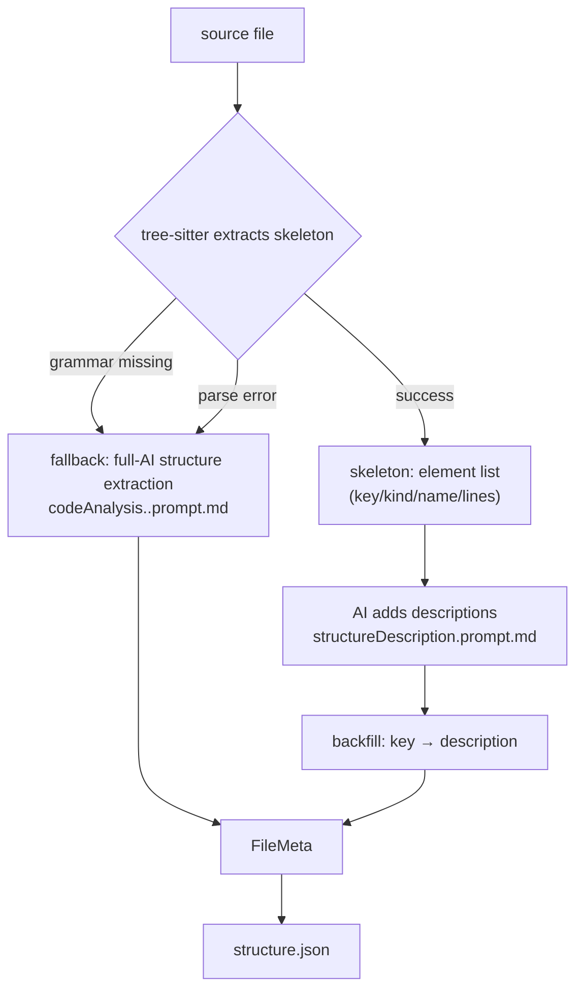

# Structure extraction and FileMeta (structure-schema)

> This file is part of the `fibo-code-analysis` skill. Read it when **touching `structure.json` structure extraction (tree-sitter / AI fallback / adding descriptions)**.
> Source of truth: the body of this file (structure-extraction division of labor / FileMeta schema / addressing-key rules) + `references/prompts/{codeAnalysis,structureDescription}*.prompt.md`.

## 1. Core division of labor: structure belongs to tree-sitter, semantics belong to AI

**Iron rule**: structural facts (an element's `kind` / `name` / line numbers) are extracted **deterministically** by tree-sitter; the AI **only adds semantic descriptions** and is forbidden to re-parse, to add/remove elements, to rename, to change line numbers, or to change types.



Both paths converge on the same **FileMeta** written to disk; the only difference is whether structural facts come from tree-sitter or from AI.

## 2. structureDescription: addressing key → description

Each element in the input skeleton carries a unique **addressing key** `key`, formatted `kind:name:startLine` (the `file` kind stands for the file-level overall description). The AI outputs a `{ key: description }` mapping:

```json
{
  "file:src/geo.ts:0": "geometry-calculation utility file, providing shapes and basic math operations",
  "function:add:7": "computes the sum of two numbers and returns the result",
  "class:Circle:4": "circle class, implements the Shape interface, provides area calculation"
}
```

Mandatory requirements:
- Keys are taken **verbatim** from the input skeleton; **creating your own / changing any character (including line numbers) is forbidden**, otherwise backfill is impossible
- Descriptions are one sentence, usually ≤ 40 characters
- Cover every element; for an element whose purpose truly cannot be determined, give the value `""`
- Output JSON only, no markdown code block, no comments

`kind` values: `file` / `function` / `class` / `interface` / `enum` / `struct` / `trait` / `protocol` / `macro` / `type_alias` / `decorator` / `annotation` / `global_variable` / `constant` / `import_class` / `import_package` / `import_module`.

## 3. FileMeta structure (structure.json contract)

`codeAnalysis.prompt.md`'s full-AI fallback produces FileMeta directly; the tree-sitter path also assembles an isomorphic object. Top-level fields (selectively included per language):

| Field group | Fields | Notes |
| --- | --- | --- |
| Basic | `file_name` `file_path` `description` `file_type` `language` | Required basic info |
| Imports | `import_class` `import_function` `import_variable` `import_package` `import_module` | Each item has `source` (third-party lib / custom lib), `filepath` (thirdparty or an inferred relative path), `lines` |
| Definitions | `function` `classes` `interfaces` `enums` `structs` `traits` `protocols` | Functions / classes / interfaces / enums / structs / traits / protocols |
| Other | `global_variables` `constants` `macros` `type_aliases` `decorators` `annotations` | Global variables / constants / macros / type aliases / decorators / annotations |

Key conventions (the full-AI path especially must obey):
- **Line numbers**: 1-based; a single-line element is `lines:[5,5]` (not `[5]`)
- **id generation**: `class_id` etc. = `file path:name` (e.g. `src/utils.ts:Date`); `function_id` = `file path:name(params)`
- **code field**: a function's `code` must be `null` (code extraction is not yet enabled)
- **Trim fields per language**: include only the fields the language supports (only C/C++ has `macros`/`structs`, only Java has `annotations`, only Python has `import_module`/`decorators`, only Rust has `traits`, only Swift has `protocols`, etc.)
- **Path inference**: for relative / alias imports, infer the full relative path from the project file-structure tree; mark package imports `thirdparty`; for a directory import find the `index` file; when it cannot be determined, mark `unknown` and note it in the description

## 4. Where the structure details in info.md come from

When `fileAnalysisInfo` produces `info.md`, it reads `structure.json` back, converts it into a markdown details section and appends a dependency section — so **the quality of the structure stage directly determines the accuracy of the file summary's dependencies / details**. When changing the FileMeta schema, remember that both the info.md rendering and the frontend parsing depend on it.

## 5. Cautions when changing structure extraction

- Adding structure capability for a language: first ensure the tree-sitter grammar can be loaded; only when the grammar is missing rely on `codeAnalysis.<lang>.prompt.md` full-AI fallback
- Don't let the structureDescription stage "fix the structure along the way": it produces descriptions only, structural facts are none of its business
- Changing FileMeta fields: it is a machine-read contract, sync the frontend parser and info.md rendering, don't change only the producing end

---
name: Structure extraction and FileMeta (structure-schema)

update-time: 2026-06-30 04:36

description: Structure-extraction details of the code-analysis skill — two paths, tree-sitter deterministic skeleton extraction vs full-AI fallback; structureDescription produces only "addressing key kind:name:line → description" and must not change the structure; FileMeta (structure.json) field contract, id generation, code=null, per-language field trimming, and path-inference rules

---
