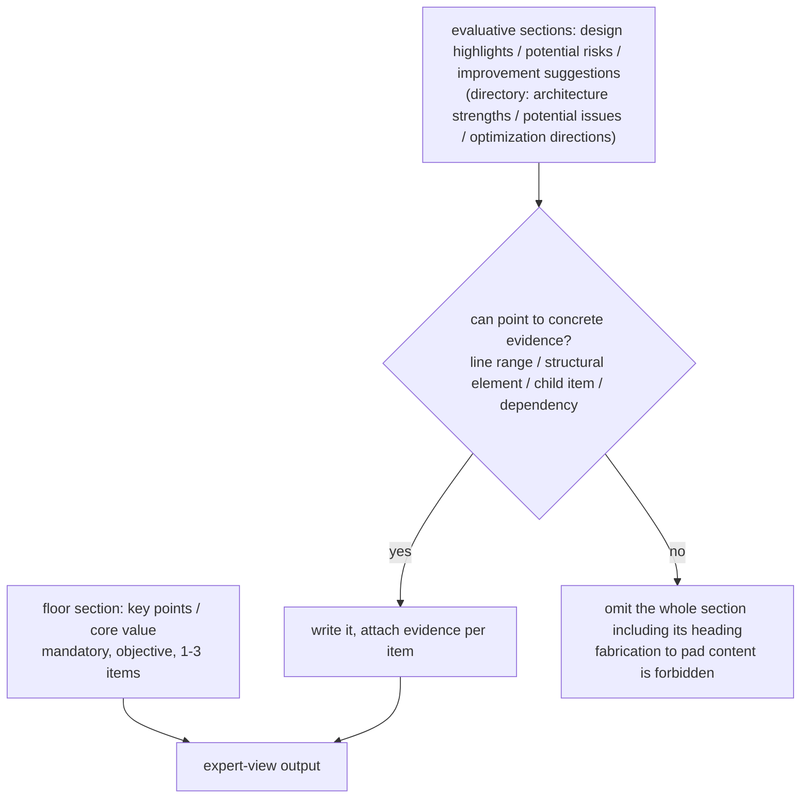

# Template-fill DSL (template-dsl)

> This file is part of the `fibo-code-analysis` skill. Read it when **writing / modifying any `*.template.md`, or having the AI produce output per a template**.
> Source of truth: `references/prompts/*.template.md` and the "template-handling requirements" section of the corresponding `*.prompt.md`.

## 1. Two-part form: the prompt teaches the approach, the template defines the skeleton

The LLM call receives both simultaneously:
- **system prompt** (`*.prompt.md`): analysis requirements, input schema, output JSON shell, template-symbol handling rules
- **the `template` field inside the user prompt** (`*.template.md`): the Markdown skeleton the AI must fill in

The AI's job is: **resolve the symbols in the skeleton per the rules, fill it into final Markdown, and return the whole thing wrapped in `{"result":"…"}`**.

## 2. Five template symbols (iron rule: no symbol may remain in the final artifact)

```mermaid
flowchart TD
  ph_001["{placeholder}"] -->|fill in actual content, remove symbols| out_006["final Markdown"]
  cm_002["(comment)"] -->|delete the whole segment (highest priority)| out_006
  opt_003["[optional block]"] -->|as appropriate: keep content and drop brackets / delete whole block| out_006
  sel_004["{A|B choice}"] -->|pick one, delete the rest and the symbols| out_006
  tag_005["<tag value=.../>"] -->|replace with a full HTML jump tag| out_006
```

| Symbol | Name | Handling rule |
| --- | --- | --- |
| `{content}` | Placeholder | Replace with actual analysis content; **must be filled, cannot be left empty**; the `{}` itself must not appear |
| `(content)` | Comment | Operation guidance for the AI only; **always delete the whole segment**, even when nested inside `[]` |
| `[content]` | Optional block | Judge by the code / directory characteristics: needed → keep the inside (with placeholders filled) and drop `[]`; not needed → delete the whole block including `[]` and content |
| `{A\|B}` | Choice placeholder | Among the `\|`-separated options pick one per the condition, delete the rest along with `{}` and `\|` (e.g. "file description\|directory description" picks one by type) |
| `<tag value="type" />` | Tag replacement | Replace with a full HTML jump tag; three kinds: `code` / `text` / `graph` |

> `{A|B}` is used only by templates like `folderSummary` that need to distinguish file / directory; `fileSummary` / `configSummary` do not have it.

## 2.1 Markdown meta-info block and blank lines

Every Markdown artifact generated from a `*.template.md` must keep, at the end of the body, a meta-info block of the three fields `name` / `update-time` / `description`; below each of the three meta-info fields keep one blank line; after `description` also leave one blank line before writing the closing separator `---`.

When `fileSummary` / `configSummary` artifacts require a `----------` terminator, the order is fixed as: body → meta-info block → `----------`.

## 3. `<tag>` replacement → always defer to markdown.md

For the three tag kinds (`code` / `text` / `graph`), their **full HTML structure, `?class=` mandatory rule, relative-path rule, graph three-part structure, Mermaid node ID `_NNN` three-digit increment, and node JSON fields** — **all defer to `fibo-conventions`' `references/conventions/markdown.md` as the single source of truth**; this skill does not re-copy them.

Stage-to-tag correspondence:

| Template | `<tag>`(s) used |
| --- | --- |
| `fileSummary.template.md` | `code` (whole-file locating under the file title) + `graph` (code concept graph) |
| `folderSummary.template.md` | `graph` (architecture concept graph) + `text` (per-file details) |
| `configSummary.template.md` | `code` (whole file + line range of each config item) |

> Difference: a **file-level** graph node's `position` is filled with the real line number; a **directory-level** graph node's `position` is uniformly `{startLine:1, endLine:1}` (a directory architecture graph does not need precise line numbers, and `code-analysis-tool` aggregates it this way too).

## 4. Output JSON shell (differentiated by functionName)

| functionName | Shell | Notes |
| --- | --- | --- |
| `fileSummary` / `folderSummary` / `configSummary` | `{ "result": "<filled markdown>" }` | result is a single string, line breaks use `\n`, inner quotes escaped |
| `structureDescription` | `{ "<addr-key>": "<description>", ... }` | keys taken verbatim from the input skeleton, must not change |
| `folderSubItem` | `{ "summary": "<≤300 chars, no markdown symbols>" }` | the compressed artifact fed to the upper-level directory summary |
| `codeAnalysis` (full-AI fallback) | FileMeta object | see structure-schema.md |

JSON escaping notes: `\"` `\\` `\n` `\t`; to reduce quote conflicts, prefer single quotes for literals inside result.

## 6. The "write only what is grounded" principle for AI-summary parts (expert view)

The "expert view" in the `fileSummary` / `folderSummary` templates is the whole doc's only free-form section with **zero structural anchor**, and is the most prone to fill-in hallucination. This skill's templates have already been tightened per the principles below; **always follow them when writing / modifying this section or adding a similar free-form section**:



Four iron rules:
- **The floor section is mandatory**: `key points` (file) / `core value` (directory) are always output, guaranteeing that artifacts of the same kind are structurally comparable and downstream aggregation is stable
- **Evaluative sections are written only when grounded**: risk / suggestion / highlight subsections are written only when they can point to concrete evidence, otherwise the whole section is omitted — do not pad content for the sake of layout
- **Suggestions attach to risks**: each `improvement suggestion` / `optimization direction` must correspond to a listed `potential risk` / `potential issue`, ruling out empty refactoring talk detached from the current state
- **Objectivity alignment**: forbid unfounded subjective empty words like "excellent", "clever", "friendly", "reasonable"; consistent with `fibo-conventions/markdown.md` §5.5's ban on subjective words in node hints

> Background: the original template made all four subsections optional + "free play", causing unstable output and inducing fabrication. This tightening has been landed across all templates and prompts in `references/prompts/` (see prompts/README.md).

## 5. Self-check (run through once before finishing a template / output)

- [ ] No residual symbols of `{}` `()` `[]` `<tag>` `|` anywhere in the final artifact
- [ ] Every `{placeholder}` is filled with actual content, none left empty
- [ ] All `(comments)` are deleted cleanly (including comments inside `[]`)
- [ ] All `<tag>`s are replaced with compliant HTML, and `?class=` and paths conform to markdown.md
- [ ] The Markdown artifact ends with a meta-info block of the three fields `name` / `update-time` / `description`, with one blank line below each of the three meta-info fields, including the blank line between `description` and the closing separator
- [ ] The whole output is wrapped in the correct JSON shell, with special characters escaped
- [ ] Jump tags / Mermaid node IDs → scan markdown.md's `AP-MD-*` once more

---
name: Template-fill DSL (template-dsl)

update-time: 2026-06-30 04:36

description: The template-fill method of the code-analysis skill — the two-part prompt(teach approach)+template(define skeleton) form; template-symbol resolution, the Markdown three-field meta-info block and the blank line below each field, <tag> replacement, the output JSON shell per functionName, and the self-check checklist

---
