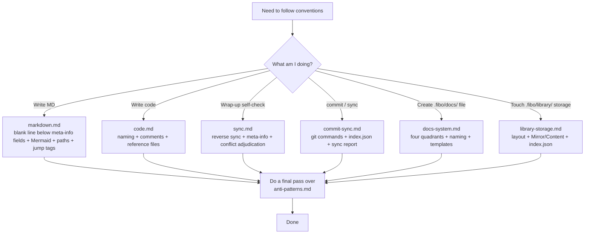

# Fibo Project Collaboration Conventions (Entry)

> This file is the **L0 entry / dispatcher**. The full rules are split by chapter under `references/conventions/`, and the anti-patterns are collected in `references/anti-patterns.md`.
> After reading this file the model can pinpoint which sub-document to read, **avoiding loading 1000+ lines every time**.

## Related skills

- **The pre-stage of a new feature / new spec** → use the `fibo-brainstorming` skill (do not jump straight into this skill)
- **Hunk-level diff records after implementation is done** → use the `fibo-recording-diff` skill (generates `.fibo/docs/specs/<feature>/diff.md`)
- **This skill applies to**: the four categories of "already started doing" scenarios — MD / code / reverse sync / commit-sync

---

## L0 one-screen quick reference (look up "which file to read" by scenario)

| What I am about to do | Must-read sub-document | Key rule in one sentence |
| --- | --- | --- |
| Write / modify any MD document | `references/conventions/markdown.md` | The end must carry `name/update-time/description`; leave one blank line below each of the three meta-info fields; key logic must use Mermaid; paths are relative and do not start with `/` |
| Write / modify any code | `references/conventions/code.md` | Semantic naming; comments state WHY not WHAT; changing code must sync the comments |
| Task wrap-up when this round touched code | `references/conventions/sync.md` | Code vs docs — code wins; the spec/design/plan/diff quartet participate equally in the sync; refresh `name/update-time/description` at the end of the doc; run a command to obtain the real `update-time` |
| User explicitly requests commit / sync | `references/conventions/commit-sync.md` | Actually run `git status` / `git diff` / `git log`; `lastSyncHash` uses the full 40-char SHA; touching MD must produce a report |
| Create any file under `.fibo/docs/` | `references/conventions/docs-system.md` + the matching template / skill | The six quadrants specs / architecture / decisions / reports / backlog / ideas; `diff.md` is generated by `fibo-recording-diff`; ADR must contain Why-not; multi-file reports get a subdirectory summarized by a README; backlog and ideas get renamed `--done` once completed; ideas are only persisted when the user explicitly asks (clarification loop + read code to assess feasibility) |
| Touch `.fibo/library/` storage (reference library / favorites / index.json) | `references/conventions/library-storage.md` | library layout; Mirror pointer vs Content copy; index.json read/write lifecycle; position must be `.fibo/`-relative |
| Conflict between docs / doc-code mismatch | `references/conventions/sync.md` §5 | Launch an Explore sub-agent to read the code and adjudicate; when the code facts are clear, code wins, and mark stale items as for-reference-only |
| Self-check / Code review | `references/anti-patterns.md` | Walk the table by number, AP-MD-* / AP-CD-* / AP-SY-* / AP-CS-* / AP-DS-* |

---

## Chapter dispatch diagram



---

## Mandatory behavior reminders (whichever sub-document you read, the following three must be obeyed)

### 1. Obtain system time across OSes (one-liner)

Whenever you need to write `update-time` / `lastSyncTime`, you **must actually run the command** to obtain the system time; **writing from memory is forbidden**.

```
bash          : date "+%Y-%m-%d %H:%M"
PowerShell    : Get-Date -Format "yyyy-MM-dd HH:mm"
any-OS fallback  : python -c "import datetime; print(datetime.datetime.now().strftime('%Y-%m-%d %H:%M'))"
```

The format is exactly `YYYY-MM-DD HH:mm` (24-hour, no seconds, no timezone). See `references/conventions/sync.md` §2.3 for details.

### 2. Task wrap-up self-check (only when this round touched code)

Before wrapping up you must walk the flow diagram in `references/conventions/sync.md` §3, and give a **design-doc sync report** in the §4 format (only three states: Updated / Not-updated / No-update-needed). If this round's code change corresponds to `.fibo/docs/specs/<feature>/`, the `spec.md` / `design.md` / `plan.md` / `diff.md` quartet participate equally in the sync; among them `diff.md` must be generated or refreshed from a real diff by `fibo-recording-diff`.

### 3. Anti-pattern quick check (must scan before finishing)

Finished MD → scan `AP-MD-*`; finished code → scan `AP-CD-*`; wrap-up → scan `AP-SY-*`; commit / sync → scan `AP-CS-*`; created a `.fibo/docs/` file → scan `AP-DS-*`. File: `references/anti-patterns.md`.

---

## File manifest (this skill's references/)

> Not a plain directory tree — each item labels **when to read / main content / key output**, so the agent can precisely locate a single file and avoid loading everything.

### `SKILL.md` (the file you are reading)
- **Role**: the L0 entry dispatcher, providing "one-screen quick reference table + chapter dispatch diagram + three global mandatory reminders".
- **What it does not hold**: the concrete rule text (in `references/conventions/*.md`), the anti-patterns (in `references/anti-patterns.md`).
- **Maintenance principle**: keep it ≤ 200 lines; new rules go into sub-documents rather than here.

### `references/conventions/` (rule text, split by scenario into files)

Each file covers one class of "already started doing" scenarios. The agent should **only read the one matching the current scenario**, not load everything.

| File | When to read (trigger scenario) | Topics in the file | Key output / side effect |
| --- | --- | --- | --- |
| `markdown.md` | Write / modify any `.md` document (incl. README / spec / design / reports) | The three-field meta-info block, one blank line below each of the three meta-info fields, Mermaid usage, path rules (relative, not starting with `/`), jump tags (`?class=code` vs `?class=text`+`.md`), chapter structure, table/list conventions | A compliant MD; agent self-checks against `AP-MD-*` |
| `code.md` | Write / modify any source code (incl. naming, comments, doc references) | Semantic naming, comments state WHY, §4 spec/design anchor format (full relative path enforced), K1-K7 checklist after finishing | Compliant code + necessary `spec:` / `design:` anchor lines; agent self-checks against `AP-CD-*` |
| `sync.md` | Task wrap-up when **this round touched code** (reverse-sync design docs) | When code-doc mismatches, code wins, the spec/design/plan/diff quartet sync equally, obtain the real system `update-time` across OSes, the doc meta-info block refresh flow, conflict adjudication (launch Explore to read code) | A "Updated / Not-updated / No-update-needed" sync report; agent self-checks against `AP-SY-*` |
| `commit-sync.md` | User **explicitly requests** commit OR doc sync (not run on every wrap-up) | Actually run `git status` / `diff` / `log` commands, `lastSyncHash` uses the full 40-char SHA, do an incremental diff based on `.fibo/index.json`, touching MD must produce a sync report | One commit + one incremental sync report; agent self-checks against `AP-CS-*` |
| `docs-system.md` | Create or reorganize any file under `.fibo/docs/` | The responsibility boundaries of the four quadrants specs / architecture / decisions / reports, file naming rules, ADR must contain Why-not, reports are snapshots not to be backfilled | New documents landed in the right quadrant with the right template; agent self-checks against `AP-DS-*` |
| `library-storage.md` | Read / modify `.fibo/library/` storage (reference library references / favorites / index.json / content copies) | library storage layout, the two semantics Mirror pointer vs Content copy, index.json CRUD lifecycle, position must be `.fibo/`-relative, data formats (index item / mermaid.json / document.md) | Correct read/write or explanation of library storage; source of truth points to code such as info.service.ts |

### `references/anti-patterns.md` (anti-pattern gallery)
- **When to read**: **a final scan before finishing** any of the five scenarios above; walk the matching group by number prefix (`AP-MD-*` / `AP-CD-*` / `AP-SY-*` / `AP-CS-*` / `AP-DS-*`).
- **Structure**: each anti-pattern = number + one-line description + wrong example + fix direction, numbers are stable (do not reorder).
- **When not to read**: for a "read-and-understand" task (no change output) it can be skipped.

### `references/*.template.md` (landing templates, used together with `docs-system.md`)

When creating a document under `.fibo/docs/`, **copy the matching template** to start, do not write from scratch:

| Template | Used to create | Read together with |
| --- | --- | --- |
| `spec.template.md` | `.fibo/docs/specs/<feature>/spec.md` — feature spec (WHAT + AC, EARS phrasing) | Persisted after the `fibo-brainstorming` skill output |
| `design.template.md` | `.fibo/docs/specs/<feature>/design.md` — design doc (HOW, each decision ↔ AC) | Persisted after the `fibo-writing-plan` skill output |
| `adr.template.md` | `.fibo/docs/decisions/ADR-NNNN-<slug>.md` — Architecture Decision Record | `docs-system.md` §ADR section; must contain Why-not |
| `backlog.template.md` | `.fibo/docs/backlog/{topic}.md` (filename without date) — deliberately deferred leftover TODO (value + deferral reason + prerequisites + related anchors; renamed `--done` on completion, backfilling the landing feature) | `docs-system.md` §backlog section; related anchors reuse `tagRule.prompt.md` |
| `ideas.template.md` | `.fibo/docs/ideas/{topic}.md` (filename without date) — the user's brainwaves (scenario + idea + feasibility assessment + clarification log; persisted only when the user explicitly asks, and persisting means a clarification loop + reading code to assess feasibility; renamed `--done` after the related feature lands) | `docs-system.md` §ideas section; related anchors reuse `tagRule.prompt.md` |
| `tagRule.prompt.md` | The code / document / graph tag prompt for writing reports / codebase analysis reports | `docs-system.md` §reports section; reports have no fixed template, the body is organized freely per the user's needs, but reference and flow-diagram tags must follow this prompt |

The `diff.md` template is not kept in this skill: the hunk-level diff record after implementation is done is maintained by `.claude/skills/fibo-recording-diff/references/diff.template.md`; once a feature enters the implementation-sync stage, `diff.md` participates in the sync equally with the sibling `spec.md` / `design.md` / `plan.md`.

---

## Final reminder before entering a sub-document

- **Code wins**: when code vs docs disagree, change the doc to match the code; when a doc is stale or docs conflict with each other, keep the original text and mark it "stale, for reference only"; only stop to confirm when the code facts are unclear or a bug is suspected
- **Sync-target whitelist**: reverse sync only touches MD the user mentioned in this session / AI-generated MD / the corresponding feature's `spec.md` / `design.md` / `plan.md` / `diff.md`; **do not scan "seemingly related" historical documents**
- **Do not invent states**: the sync report has only the three states "Updated / Not-updated / No-update-needed"
- **Do not silently paper over conflicts**: when the code facts are clear, mark the old entry "stale, for reference only" and leave the source of truth; when the code facts are unclear or a bug is suspected, stop and report

---
name: Fibo Collaboration Conventions Entry (L0 dispatcher)

update-time: 2026-07-09 05:43

description: The L0 entry of the collaboration conventions, defining quartet sync, report date-prefix naming, multi-file report archiving, the backlog deferred-TODO template (filename without date), the ideas capture template (persisted only when the user explicitly asks + clarification loop + read code to assess feasibility), and the tagRule reference-prompt rules

---
