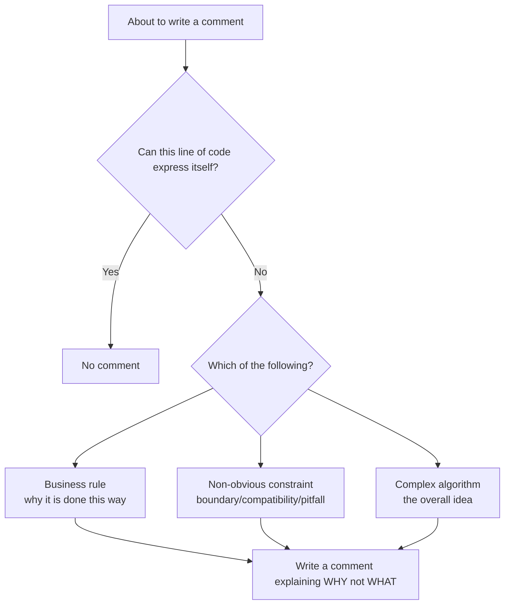
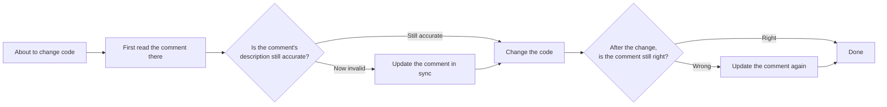

# Code Writing Conventions

> This file is part of the `fibo-conventions` skill. **All scenarios of writing / modifying code** must obey every clause in this file.
> The anti-patterns are collected in `references/anti-patterns.md`.

## 1. Clear naming

- Function names: start with a verb, express "what it does", e.g. `parseUserConfig` rather than `handle`, `process`
- Variable names: nouns, express "what it is", avoid empty words like `data`, `info`, `tmp`, `obj`
- Booleans: `is/has/can/should` prefix
- Constants: `UPPER_SNAKE_CASE`
- No pinyin or abbreviations (except industry-common abbreviations like `id` `url` `db`)

---

## 2. Comments state "intent", not "translation"



Mandatory requirements:
- **Important functionality must have block comments**: at the entry of a function / class / module, explain "what it does + why + key constraints"
- **Non-obvious logic must have inline comments**: magic numbers, special compatibility, worked-around bugs, performance trade-offs, etc.
- No "code-translation style" comments (e.g. `// i increments by 1`)
- Functions, methods, classes, and public APIs in §2.1 must use language-native documentation comments that editor hover and signature help can display

### 2.1 Editor-visible documentation comments (global rule)

When adding or modifying a named function, method, class, or public API, write a documentation comment using a form recognized by the project's language server so IDEs such as VS Code can display it on symbol hover or in signature help. This is a documentation-comment rule, not a requirement to add ordinary inline comments or duplicate type annotations.

- Prefer the repository's established documentation style; when none exists, use the language mapping below
- At minimum, describe the declaration's responsibility; document non-obvious parameter semantics, return behavior, exceptions, boundary conditions, and side effects when applicable
- Keep types in the language's type syntax when available; do not repeat type information that the signature already makes clear
- Anonymous callbacks and semantically obvious trivial private helpers may omit documentation comments
- An ordinary comment does not satisfy this rule unless it is the language's native documentation form recognized by the language server

| Language | Documentation form |
| --- | --- |
| TypeScript / JavaScript | JSDoc / TSDoc `/** ... */` |
| Python | A function or class docstring, with parameter and return type hints in the signature |
| Java / Kotlin | Javadoc / KDoc |
| Go | A declaration comment immediately above the symbol, beginning with the symbol name |
| C / C++ | Doxygen-compatible `/** ... */` or `///` |
| Rust | Rustdoc `///` |
| Other languages | The native documentation-comment form supported by the project's language server |

---

## 3. Comments and code are updated in sync (core rule)



**Absolutely forbidden**:
- Changing code but leaving an old comment inconsistent with the new behavior
- Deleting code but keeping a leftover comment
- Renaming a function / parameter but leaving the old name in the comment

Self-check before every commit: are the modified function's header comment and inline comments still valid.

---

## 4. Reference supporting docs at key logic (spec / design anchor format)

### 4.1 Trigger conditions (add a spec/design anchor only in the following two scenarios)

1. **A key decision lands**: the code segment implementing some AC or some design decision (D-NN)
2. **A doc is needed to explain the code intent**: an implementation where reading the code alone leaves the WHY confusing

Other scenarios (ordinary utility functions, obvious CRUD, pure implementation details) **omit** the spec/design anchor.

### 4.2 Writing (unified format, multi-line preferred)

**Mandatory constraints**:
- ❌ **Isolated numbers** like `task-09` / `D5` / `AC-03` are forbidden (references detached from the filename); detached from context they are baffling
- ❌ **Shorthand references** like `per spec.md AC-X` / `see design.md D2` are forbidden (not using the unified `spec:` / `design:` line format, later agents find it hard to batch-recognize / jump)
- ✅ References must use the `spec:` / `design:` line format of §4.2, **and the anchor path must be a full relative path** (in the form `.fibo/docs/specs/<feature>/spec.md#AC-03`), it is not allowed to write only `spec.md#AC-03`
- ✅ Multi-line comments (block comment / docstring) → use the multi-line format; when multi-line is impossible (e.g. inline) → use the single-line format

**Multi-line format (preferred, friendly to JSDoc / TSDoc hover display)**:

```
spec: <spec md filename>#<anchor>

design: <design md filename>#<anchor>

<the real code comment: lay an index and explanation for later agents; state the WHY and key constraints>
```

- The `spec:` / `design:` lines always come first; if one is missing, omit that line (do not write `spec: -`)
- Multiple `spec:` / `design:` references must each be on their own line, with one empty comment line between reference lines; this is so the IDE hover tooltip renders references line by line, not crammed into one block
- **The path must be a full relative path** (`.fibo/docs/specs/<feature>/spec.md`), it is not allowed to write only `spec.md` — so a later agent can jump directly without context
- Common anchor forms: `#AC-XX`, `#D-NN`, `#section-heading`
- After the reference block, leave one blank line, then write "the real comment" — this paragraph is the "index + explanation" for later agents, and must be understandable in gist even detached from the anchor

TypeScript / JSDoc standard style for multiple references:

```ts
/**
 * spec: .fibo/docs/specs/analysis-info-metadata/spec.md#AC-04
 *
 * spec: .fibo/docs/specs/analysis-info-metadata/spec.md#AC-05
 *
 * spec: .fibo/docs/specs/analysis-info-metadata/spec.md#AC-06
 *
 * spec: .fibo/docs/specs/analysis-info-metadata/spec.md#AC-08
 *
 * spec: .fibo/docs/specs/analysis-info-metadata/spec.md#AC-11
 *
 * design: .fibo/docs/specs/analysis-info-metadata/design.md#D2
 *
 * design: .fibo/docs/specs/analysis-info-metadata/design.md#D4
 *
 * design: .fibo/docs/specs/analysis-info-metadata/design.md#D5
 *
 * Here goes the real code comment: explain the WHY, key constraints, and how these AC / design decisions land in the current implementation.
 */
```

**Single-line format (only when multi-line is impossible)**:

```
// spec: spec.md#AC-03 | <comment body>
```

Use `|` to separate the anchor from the body; at most two anchors, more than that switches to multi-line.

### 4.3 Examples

TypeScript (multi-line / block comment / trigger = a key decision lands):

```ts
/**
 * spec: .fibo/docs/specs/auth-login/spec.md#AC-03
 *
 * design: .fibo/docs/specs/auth-login/design.md#D2
 *
 * Parse the user config file. Implements the "priority merge" rule of decision D2:
 * env var > user config > project default > built-in fallback; higher priority overrides on conflict.
 *
 * Reading tip for later agents: first read the design.md#D2 table for the priority matrix,
 * then come back to this function to see it land; this function does not handle the watcher type — that is ConfigWatcher's job.
 */
export function parseUserConfig(raw: string): UserConfig { ... }
```

Python (multi-line docstring / trigger = a doc is needed to explain intent):

```python
class RateLimiter:
    """spec: .fibo/docs/specs/rate-limit/spec.md#AC-02

    design: .fibo/docs/specs/rate-limit/design.md#D4

    A token-bucket rate limiter. The threshold and burst factor come from the capacity assessment in D4 (do not change casually,
    revisit D4's capacity model before changing, otherwise you will overwhelm the downstream service).
    """
```

Single-line (trigger = inline magic number + multi-line impossible):

```ts
const TOKEN_BUCKET_CAPACITY = 100;  // spec: .fibo/docs/specs/rate-limit/spec.md#AC-02 | capacity ceiling, see D4 before changing
```

Ordinary utility function (not triggered, omit the spec/design anchor):

```ts
/**
 * Convert a camelCase string to a hyphen-lowercase string.
 */
function toKebab(s: string): string { ... }
```

### 4.4 Mandatory constraints

- ❌ **No isolated numbers**: any number in a comment without a filename prefix, like `task-09`, `AC-3`, `D5`, is rewritten
- ❌ **No padding for the sake of it**: if the trigger conditions are not met, do not write a spec/design line; forcing it only pollutes the signal-to-noise ratio
- ❌ **Do not copy large chunks of the design doc**: that is the doc's job, the comment is only responsible for "pointing the way + WHY + index"
- ✅ **Doc renamed / moved → sync the reference** (same source as the §3 comment-sync rule)
- ✅ **If there is no corresponding md file, omit the spec/design line**, write only "the real comment"

---

## 5. Self-check checklist after finishing code (mandatory)

Every time after writing / modifying code, **before** delivery (commit / wrap-up report), walk item by item:

| # | Check item | Failure example |
| --- | --- | --- |
| K1 | Semantic naming, no `data` / `info` / `tmp` / `obj` / pinyin | `function handle(d)` ❌ |
| K2 | The modified function / method / class has the §2.1 documentation comment when required, and its header / inline comments are still consistent with the new behavior (§3) | Added a named function without an editor-visible documentation comment ❌ |
| K3 | No "translation-style" comments (§2) | `// i increments by 1` ❌ |
| K4 | **Comments where a key decision lands / a doc is needed to explain intent** use the §4.2 format, the spec/design line carries the **full relative path** + anchor; multiple references each on a line with an empty comment line between | `// task-09 use this` isolated number ❌ / `per spec.md AC-X` shorthand ❌ / only `spec.md#AC-03` without the directory ❌ / multiple references crammed onto consecutive lines ❌ |
| K5 | **Ordinary utility functions / CRUD have no spec/design anchor crammed in** | Adding a spec line to `toKebab()` too ❌ |
| K6 | The deleted function / parameter has no leftover old comment or stale reference | Function deleted, README still mentions it ❌ |
| K7 | The referenced .md file path really exists (does not point to a deleted / renamed doc) | `spec: old-feature/spec.md` but the directory was renamed ❌ |

If it passes, continue silently — no need to report passing checklist items to the user. Any failure → fix it yourself until all pass.

---
name: Code Writing Conventions

update-time: 2026-08-26 03:42

description: The rules for writing or modifying code, including semantic naming, language-native editor-visible documentation comments, WHY-oriented comments, spec/design anchors, and the K1-K7 self-check

---
