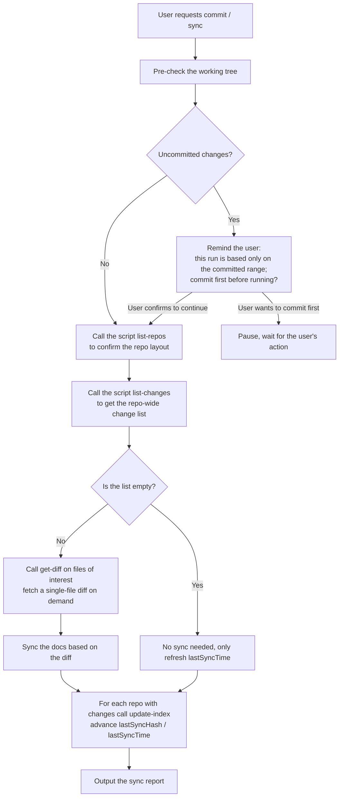

# Batch doc sync when the user requests a commit or an explicit sync (rules)

> This file is part of the `fibo-conventions` skill. **This flow triggers only when the user explicitly requests a commit or a sync**; all other scenarios go through the regular reverse sync in `sync.md`.
> For the cross-OS command to obtain system time see `sync.md` §2.3. For the code / document jump-tag format see `markdown.md`.
> For the sync helper scripts and the `.fibo/index.json` v2 schema see the related spec:

<div style="display: flex; align-items: flex-end;">
    <span style="background: var(--tag-text-bg); margin: 8px 0 8px 14px; padding: 6px 12px; border-radius: 4px; border-left: 4px solid var(--tag-text-border); color: var(--tag-text-fg); font-size: 14px; font-weight: 500;">
        <a target="_self" href="#.fibo/docs/specs/fibo-index-v2-sync-scripts/spec.md?class=text" style="color: inherit; text-decoration: none;">
            Document: .fibo/docs/specs/fibo-index-v2-sync-scripts/spec.md
        </a>
    </span>
</div>

## 1. Trigger conditions (strictly tightened)

| Example trigger phrasing | Behavior |
| --- | --- |
| "sync the docs", "sync docs", "align the docs", "align the docs with the code", "update the doc anchors", "commit for me", "/commit", "commit it" | Go through this flow |

**Two core constraints**:
1. **The AI does no git writes**: this flow does **not** run `git add` / `git commit` / `git push`. Whether to commit is the user's own decision.
2. **The baseline source is committed code**: the script reads the `lastSyncHash..HEAD` range. Uncommitted changes in the working tree do **not** participate in this analysis; if the user wants uncommitted changes to be synced too, remind them to commit first.

**Cases that do not trigger**: the user just changed code without saying sync; the user asks "what's the status"; the user is writing docs; the AI proactively wants to "do it while at it" — none of these trigger.

---

## 2. Core sequence



---

## 3. `.fibo/index.json` — v2 schema

Fixed schema:

```json
{
  "schemaVersion": 2,
  "repos": [
    { "path": ".", "lastSyncHash": "", "lastSyncTime": "" }
  ]
}
```

Field constraints:
- **`schemaVersion`**: fixed as `2`. v1 is **not** auto-migrated; the user must manually delete `.fibo/index.json` and re-initialize.
- **`repos[]`**: all git repos under the project (including the root repo and nested sub-repos). Written by shadow-git initialization based on the sub-repo scan result; when there is currently no repo, `repos: []`.
- **`repos[].path`**: the relative path to the repo root (= the parent directory of `.fibo/`); the root repo itself is written as `"."`. Does not start with `/` or a drive letter.
- **`repos[].lastSyncHash`**: the full 40-char SHA of the latest commit **already analyzed** in the last sync; empty string initially.
- **`repos[].lastSyncTime`**: the local time the last sync completed, in the format `YYYY-MM-DD HH:mm`; empty string initially.
- The file lives at `.fibo/index.json` (in the `.fibo/` root, **not** `.fibo/docs/`).

---

## 4. Mandatory script invocation (no longer assembling git commands directly)

**The AI no longer assembles `git status` / `git diff` / `git log` / `git show` itself**. All sync baseline queries go uniformly through the script `<skill-root>/scripts/sync-helper.{sh,ps1}`.

### 4.1 Locate the script path

| Platform | Path |
| --- | --- |
| POSIX (macOS / Linux / Git Bash) | `<skill-root>/scripts/sync-helper.sh` |
| Windows (native PowerShell) | `<skill-root>/scripts/sync-helper.ps1` |

`<skill-root>` = the absolute path of the directory where this skill `fibo-conventions` resides. Each agent (Claude Code / Codex / OpenCode etc.) locates its own skill root per its own convention.

### 4.2 Subcommand list

| Subcommand | Arguments | Output (stdout) | Failure exit code |
| --- | --- | --- | --- |
| `list-repos` | none | JSON array: `[{ "path": ".", "hasUncommittedChanges": false }, ...]` | 5 (schema mismatch) |
| `list-changes` | none | JSON array: `[{ "repo": ".", "file": "src/foo.ts", "status": "M" }, ...]`; automatically filters common binary extensions | 5 |
| `get-diff` | `--repo <path> --file <relpath>` | Single-file unified diff; when the file is not in the change list, outputs empty and exits 0 | 3 / 6 / 7 |
| `update-index` | `--repo <path> --hash <40SHA>` | none (only writes `.fibo/index.json`) | 3 / 4 / 6 / 7 |

### 4.3 Common exit codes

| Code | Meaning |
| --- | --- |
| 0 | Success |
| 1 | Usage error (missing subcommand / unknown subcommand) |
| 2 | Cannot find the `.fibo/` directory (not inside a Fibo project) |
| 3 | An argument hit the dangerous-character blacklist or is an absolute path |
| 4 | Illegal hash format (not 40 hex chars) |
| 5 | `.fibo/index.json` missing or not v2 schema |
| 6 | Unknown flag |
| 7 | The path pointed to by `--repo` is not in `repos[]` |

### 4.4 Invocation constraints

- ✅ **Must**: invoke all subcommands through the script itself, arguments filtered by the script's internal blacklist
- ❌ **Forbidden**: bypassing the script to call `git diff` / `git log` / `git show` directly
- ❌ **Forbidden**: chaining multiple subcommands into one shell pipeline passed to the shell (the script itself is the unified entry)
- ❌ **Forbidden**: letting the script access working-tree files other than `.fibo/index.json` (the script itself is already constrained, no extra guarantee is needed from the AI; but the AI should not mistakenly expect the script to "do other things while at it")

---

## 5. Candidate MD retrieval rules

After `list-changes` gives the change-file list, you need to find "MD that mention these files" within the repo as candidate sync targets.

- **Scope**: **repo-wide `**/*.md`** (including `README.md`, `CHANGELOG.md`, `.fibo/docs/`, and MD anywhere else)
- **Exclude**: `.git/`, `node_modules/`, `dist/`, `build/`, `out/`, `coverage/`, other vendored directories
- **Hit condition**: the relative-path string of a change file appears **anywhere** in the MD file content
  - Including: paths in `href`, prose references, directory listings, paths in comments
- **Sort by hit count**: MD mentioned by multiple change files is processed first
- **Retrieval means**: use the current agent platform's "repo-wide content search" capability (e.g. ripgrep / a built-in grep tool); the script itself is not responsible for this step

---

## 6. Doc-update boundaries (removing the vague term "business-rule conflict")

| Situation | Example | Handling |
| --- | --- | --- |
| **Implementation-detail drift** | Line-number anchor moved, interface name changed, file renamed, a deleted symbol still referenced, a new public API not in the doc | Update the doc directly per the code |
| **Doc rules lag the current code** | The doc AC says "timeout 30s", the current code stably implements 60s; the call chain explained by an old diff has been replaced by a new implementation; two specs give conflicting descriptions of the same behavior | Update the effective description with code as the truth; keep the old entry and mark `stale, for reference only` nearby, write the code source of truth in the report |
| **Code facts unclear / suspected bug** | Multi-branch behavior cannot be confirmed; the implementation looks like it breaks the critical path; tests and code facts contradict each other | **Stop and report to the user**: the difference + scope of impact + what the user needs to decide; do not use doc sync to paper over an uncertain implementation |
| **Report-type docs** (`reports/`) | Investigation / audit / retrospective snapshots | **Do not participate in this sync** (snapshot nature, per `docs-system.md` §2) |
| **Unrelated beautification** | Adjusting the layout of an unrelated section / fixing grammar | **Forbidden** to change while at it |

> 📌 `.fibo/docs/specs/**/{design,plan,diff}.md` are treated equally with `spec.md` = **living contracts**, participating in this sync flow; among them `design.md` additionally triggers the §9 consistency check, and `diff.md` must be refreshed from a real diff / patch, backfilling hunks from memory is forbidden.

---

## 7. Update `index.json` and the sync report

### 7.1 Update rules

- **Each repo with changes must call `update-index` once**, regardless of whether MD was actually changed this time
- `--hash` passes the **full 40-char SHA of the latest HEAD** (obtained via the current agent's "read file / run command" capability, e.g. one read-only `git rev-parse HEAD`)
- `--repo` passes the `path` (relative path) of the corresponding entry in `repos[]`
- `lastSyncTime` is filled by the script's local system time; the AI does **not** need to get the time itself

### 7.2 Sync-report format

The report is fully text-based, the git commands themselves do not appear:

```
Doc sync complete (the AI made no git commit; whether to commit is the user's decision).

Repo layout: ., packages/ui
Analysis range:
  . :          lastSyncHash 7e8f9a0... → HEAD def5678...
  packages/ui: lastSyncHash empty → HEAD abc1234...
Repo-wide grep hit Y candidate MD

Doc sync report:
- README.md: Updated (fixed 1 interface name fooBar → fooBaz)
- .fibo/docs/specs/auth/spec.md: Updated (AC-3 implementation anchor 120-155 → 130-170)
- .fibo/docs/specs/auth/diff.md: Updated (refreshed 2 files / 4 hunks from the commit-range diff)
- .fibo/docs/specs/auth-legacy/spec.md: Updated (marked AC-2 stale, for reference only; source of truth src/auth/session.ts:120-155)
- .fibo/docs/reports/2026-05-audit.md: No-update-needed (snapshot doc does not participate in sync)
- docs/legacy/old-plan.md: Skipped (code facts unclear, see the conversation above; stopped, no auto-change made)

.fibo/index.json advanced via update-index:
  . : lastSyncHash=def5678..., lastSyncTime=2026-05-14 09:15
  packages/ui: lastSyncHash=abc1234..., lastSyncTime=2026-05-14 09:15
```

---

## 8. Mandatory constraints

- ❌ Do not trigger this flow when the user has not explicitly requested commit / sync
- ❌ Do not perform any git write (add / commit / push) in this flow
- ❌ Do not reuse the previous script output from memory / conversation history — re-call the script each time to get data
- ❌ Do not bypass the script to assemble git commands directly
- ❌ Do not quietly modify MD without producing a report
- ❌ Do not skip the `update-index` call (even if no MD was changed this time, still advance the corresponding repo's `lastSyncHash` to the new HEAD)
- ❌ When code facts are unclear or a bug is suspected, pause and **do not update `index.json`** (keep the old hash, advance next time after the user decides)
- ❌ Do not skip the repo-wide search for candidate MD by looking only at `.fibo/docs/`
- ❌ `lastSyncHash` must be the full 40-char SHA, short hashes are not allowed
- ❌ Do not modify snapshot / tool artifacts like `.fibo/scripts/`, `.fibo/docs/reports/`
- ❌ Do not skip `diff.md` as a reports snapshot; it participates in the sync equally with spec/design/plan, but can only be refreshed driven by a real diff
- ❌ Do not delete conflicting old entries to fabricate doc consistency; you must keep them and mark `stale, for reference only`

---

## 9. design.md consistency check (per workflow-pipeline AC-D3)

In the sync stage of this flow, for **every** candidate-hit `.fibo/docs/specs/<feature>/design.md`, do an extra "declaration vs reality" consistency check.

### 9.1 Check targets

- In design.md Section 3 "File list", the "path" column cells of the **"new"** and **"modified"** tables. The "unchanged" column does not participate in the check.
- The path can be an exact path or a glob (`path/glob/*.ts`). A glob is considered present as long as it matches at least 1 real file.

### 9.2 Check logic

```mermaid
flowchart LR
  P[Parse design.md §3<br/>take all "new/modified" paths] --> E{For each path<br/>do an existence check}
  E -->|Path missing / glob 0 hits| MISS[Record in the "missing list"]
  E -->|Path exists| OK[Skip]
  MISS --> R[Report in the sync report:<br/>design.md Updated (removed X)]
```

- The existence check is implemented cross-OS: use `ls <path>` / `Test-Path <path>` / `python -c "import os; print(os.path.exists('<path>'))"`, globs use shell wildcards.
- "Missing" means the code was deleted / renamed but design.md was not synced to remove it → mark `design.md: Updated (removed X)` in the report to remind the user.

### 9.3 What not to do (boundaries)

- ❌ **No interface-signature comparison** (grepping function names / class names) — high cost, prone to false positives, per design D7.
- ❌ **Do not report "exists in reality but not declared in design"** — design only declares the main entries; adding a helper file is not a deviation.
- ❌ Do not do the same check on plan.md (plan.md's "files involved" was already injected via prompt to constrain the executor in the executing-plan stage).

### 9.4 Report examples (folded into §7.2)

```
- .fibo/docs/specs/auth/design.md: Updated (removed src/auth/old-helper.ts, because the actual file was deleted)
- .fibo/docs/specs/auth/design.md: No-update-needed (all 4 declared files exist)
```

---
name: commit / explicit-sync-triggered batch doc sync conventions

update-time: 2026-07-05 21:43

description: The explicit sync flow: sync the quartet based on the incremental diff and mark stale items

---
