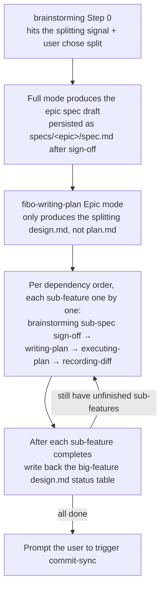

# The `.fibo/docs/` document system

> This file is part of the `fibo-conventions` skill. It must be obeyed when creating any file under `.fibo/docs/`, or when deciding "which category this document belongs to".
>
> **General principle**: all software-engineering development documents are **funneled uniformly** under `.fibo/docs/`; MD design docs are no longer scattered in the project root, `src/`, etc. (except project-level generic meta files like `README.md`, `CHANGELOG.md`).

## 1. Directory structure and responsibilities

```
.fibo/docs/
├── specs/                  # Feature specs: sliced vertically by feature, one directory per feature
│   ├── <feature>/
│       ├── spec.md         # WHAT / WHY / AC + implementation anchors (mandatory)
│       ├── design.md       # HOW, single-feature design (produced by fibo-writing-plan, participates in sync)
│       ├── plan.md         # Task list, tasks split by AC (produced by fibo-writing-plan, participates in sync)
│       ├── diff.md         # Hunk-level diff explanation record after implementation is done (produced by fibo-recording-diff, participates in sync)
│       └── design/         # HOW, split by topic only for extremely complex features (optional)
│           ├── arch.md
│           ├── data-model.md
│           └── api.md
│   └── <epic-feature>/     # Big-feature directory: used when the change surface is too large and needs splitting first (see §3.1)
│       ├── spec.md         # Epic spec: overall goal + high-level AC + sub-feature boundaries + Non-goals (mandatory)
│       ├── design.md       # Splitting design: how to split / dependency order / total AC ↔ sub-feature mapping / status table
│       │                   #   Must contain the fixed section "## Sub-feature splitting"; the big-feature directory has no plan.md / diff.md
│       ├── <sub-feature-1>/ # Sub-feature: the standard quartet (spec / design / plan / diff), same structure as <feature>/
│       └── <sub-feature-2>/
├── architecture/           # Cross-feature global view (system architecture, module dependencies, deployment)
├── decisions/              # ADR: architecture / choice decision records (incl. Why-not)
├── reports/                # One-off output: investigation / codebase analysis / audit / performance / retrospective
│   ├── {YYYY-MM-DD}-{topic}.md         # Single-file report: when one investigation produces only one, place it directly under reports/ (date prefix + topic)
│   └── {investigation-name}/           # Multi-file investigation: when one investigation produces ≥ 2 reports, create a subdirectory to group them (directory name without date)
│       ├── README.md                   #   [the only fixed file] directory navigation: list what files are in this directory + a one-line summary of each
│       ├── findings.md                 #   The rest are all report files named semantically by topic (no date prefix needed)
│       └── recommendations.md
├── backlog/                # Deliberately deferred leftover TODOs: valuable in the future, but insufficient conditions now or deferred after a trade-off
│   ├── {topic}.md                      # TODO entry: filename uses only the topic, no date; records value / deferral reason / prerequisites / related anchors
│   └── {topic}--done.md                # After completion: filename appends --done, and backfills the "landing feature" section
├── ideas/                  # The user's brainwaves: feature points / optimization points that pop up in conversation, persisted only when the user explicitly asks to "record an idea"
│   ├── {topic}.md                      # Idea entry: named like backlog (only the topic, no date); records scenario / idea / feasibility assessment / clarification log
│   └── {topic}--done.md                # After the related feature lands: filename appends --done, and backfills the "related landing feature" section
└── (optional) index.md     # Top-level index, listing active specs and ADRs
```

---

## 2. The meaning of each directory and its traditional software-engineering counterpart

| Directory | Meaning | Traditional counterpart | Lifecycle |
| --- | --- | --- | --- |
| `specs/<feature>/spec.md` | A single feature's "what to do + why + acceptance criteria + implementation anchors" | Requirements spec (SRS) + acceptance criteria | **Living contract**, continuously synced with the code |
| `specs/<feature>/design.md` | A single feature's "how to do it": goals / key design decisions (each ↔ AC) / file list / interface contracts / interaction with existing modules | Detailed design (DDD) | **Living contract**, generated by `fibo-writing-plan`, consistency-checked at commit-sync |
| `specs/<feature>/plan.md` | A single feature's implementation task list: each task has the AC involved / files involved / acceptance method / status | Implementation plan / task breakdown | **Living contract**, generated by `fibo-writing-plan`, consumed by `fibo-executing-plan` and its status refreshed, participates in sync at commit-sync |
| `specs/<feature>/diff.md` | Hunk-level explanation after a single feature's implementation is done: recommended reading order / code anchors / the design logic of each hunk / cross-file Mermaid main line | Implementation diff record / review aid | **Living contract**, generated or refreshed by `fibo-recording-diff` from the real diff, participates in sync equally with spec/design/plan; does not add AC, does not change design decisions, does not replace plan status |
| `specs/<feature>/design/*.md` | Sub-designs split by topic for extremely complex features | Detailed design (DDD) | Living contract, updated mainly during major refactors |
| `specs/<epic>/spec.md` | The epic spec of a big feature: overall goal + high-level AC + sub-feature boundary division | System-level requirements spec | **Living contract**, the upstream source of truth for sub-feature specs |
| `specs/<epic>/design.md` | The **splitting design** of a big feature: how to split / why split this way / dependency order / total AC ↔ sub-feature mapping / sub-feature status table; **no implementation details** | System-level outline design | **Living contract**, the status table is written back after each sub-feature completes |
| `specs/<epic>/<sub-feature>/*` | The standard quartet of a sub-feature, rules identical to `specs/<feature>/` | Same as the rows above | Same as the rows above |
| `architecture/*.md` | A cross-feature system panorama (module dependencies, deployment topology, shared infrastructure) | System architecture document (SAD) / IEEE 1471 | Living contract, updated per milestone |
| `decisions/{NNNN}-{slug}.md` | A decision's final choice + rejected options (Why-not) | ADR (Michael Nygard) | **Immutable**, when overturned create a new ADR and mark `superseded by` |
| `reports/{YYYY-MM-DD}-{topic}.md` | **Snapshot-style** conclusions such as investigation / codebase analysis / audit / performance / retrospective | Investigation report / codebase analysis report / Post-Mortem | **Snapshot**, does not participate in reverse sync |
| `backlog/{topic}.md` | A deliberately deferred leftover TODO: value + why deferred + prerequisites + related anchors; renamed `--done` on completion and backfills the landing feature | Tech debt / TODO backlog / Someday-Maybe | **Status entry**: `pending → done`, does not enter the quartet sync; when work starts, separately create `specs/<feature>/` |
| `ideas/{topic}.md` | The user's brainwave: scenario + idea (self-consistent statement) + feasibility assessment (conclusion after reading code) + clarification log; renamed `--done` after the related feature lands | Requirement germination / inspiration capture / requirement clarification record | **Status entry**: `clarifying → clarified → (implementing) → done`, does not enter the quartet sync; persisted only when the user explicitly asks; when promoted to a formal feature, separately create `specs/<feature>/` |

---

## 3. Key decision rules

- **New feature / requirement** → create `<feature>/spec.md` under `specs/`, AC uses EARS phrasing
- **The change surface is too large and can be split into multiple small features** → go through the §3.1 big-feature splitting mode: first create `specs/<epic>/` (epic spec + splitting design), then create sub-feature directories under it
- **A feature's implementation design / task breakdown** → after the spec is signed, call `fibo-writing-plan` to produce `design.md` + `plan.md` in the same directory; only extremely complex features split sub-files by topic under `design/`; the simplest features can write only within spec.md §5
- **The diff explanation record after implementation is done** → call `fibo-recording-diff` to produce `diff.md` in the same feature directory; it explains the design logic of the real hunks, is not written to `reports/`, and does not backfill AC or design decisions; on subsequent code changes it must participate as a sibling living contract in reverse sync and commit-sync
- **Living-contract later drift / conflict** → when `spec.md` / `design.md` / `plan.md` / `diff.md` conflict with the code or with other specs, the code facts win; keep the old entry and mark `stale, for reference only`, do not delete the historical context
- **Cross-feature** or global architecture → `architecture/`
- **"Why choose A not B"** → create a new ADR under `decisions/`, **must contain a Why-not section**
- **One-off investigation / codebase analysis / audit / retrospective** → `reports/`, filename carries year-month, **does not participate in reverse sync**
  - When the user asks to write an "investigation report / research report / analysis report" and the content includes codebase structure analysis, module relationship mapping, code-reference evidence, codebase analysis conclusions, treat it as a report too, land it in `reports/`, do not scatter it in the project root or the source directory
  - Report-type artifacts have **no fixed template**: the AI should organize sections and depth freely per the user's question; but key code logic, flow-diagram logic, code references, and document references must read and follow `references/tagRule.prompt.md`
  - **Single output** → land it directly at `reports/{YYYY-MM-DD}-{topic}.md` (date prefix + topic, `{topic}-{YYYYMM}.md` is forbidden)
  - **Multiple outputs** (one investigation needs ≥ 2 reports split: overview / data / recommendations / sub-topics etc.) → you **must** first create a `reports/{investigation-name}/` subdirectory and then place files; do not lay multiple same-prefix MD flat in the `reports/` root
  - **Creating a directory under `reports/` requires adding a README** (only for `.fibo/docs/reports/`): whenever you create a subdirectory under `reports/`, you **must** add a `README.md` inside it, collecting and summarizing all report files produced by this investigation, explaining the directory's purpose, which files it contains, and a one-line summary of each; after adding a report you must go back and update the `README.md` list. Other quadrants (specs / architecture / decisions) are not bound by this rule
- **Deliberately deferred leftover TODO / tech debt / "worth doing in the future but not now"** → `backlog/`, start with `references/backlog.template.md`
  - Applicable scenario: during development you identify something **valuable in the future** but with **insufficient conditions now** or **deferred after a trade-off**, and need to keep a record of "why not now + under what conditions to pick it up again"
  - Boundaries with other quadrants: **not a spec** (no AC, does not enter the quartet sync); **not an ADR** (not a finalized architecture decision); **not a report** (not a one-off investigation snapshot)
  - The file must record: **TODO value** / **why it was not done then** (insufficient conditions or a trade-off) / **prerequisites** (decidable, work can start once met) / **related anchors** (feature directory, docs, code, references follow `references/tagRule.prompt.md`)
  - **Naming without date**: the filename uses only the topic in hyphen-lowercase English (`{topic}.md`), **different** from the reports date-prefix rule; backlog is laid flat under `backlog/`, with no multi-file subdirectory + README requirement like reports
  - **Status values**: the top `Status` has four states `pending` (to do) / `implementing` (prerequisites met, spec created and work started) / `done` (completed) / `won't-do` (dropped after re-review)
  - **State transitions**:

  ```mermaid
  stateDiagram-v2
      [*] --> Pending: "identified during development<br/>filed as backlog/{topic}.md"
      Pending --> Pending: "prerequisites unmet<br/>periodic re-review"
      Pending --> Implementing: "prerequisites met<br/>create specs feature dir and build"
      Pending --> WontDo: "dropped after re-evaluation"
      Implementing --> Done: "feature shipped<br/>backfill Section 5, rename with --done suffix"
      Done --> [*]
      WontDo --> [*]
  ```

  - **Completion transition**: when work actually starts, separately create `specs/<feature>/` to implement; after implementation, go back to this entry and backfill the "Completion backfill" section (landing feature + differences), rename the **file from `{topic}.md` to `{topic}--done.md`**, change the top Status to `done`, and add the Done date (if dropped, change to `won't-do`, filename without `--done`)
- **The user's brainwaves / inspiration / "it'd be great if this could ..."** → `ideas/`, start with `references/ideas.template.md`
  - **Persistence trigger**: only write a file **when the user explicitly says "record my idea / note down this idea / save this thought"**. Daily chit-chat, a casual mention without asking to record, is not persisted proactively (to avoid archiving every riff as an idea)
  - Applicable scenario: a **feature point / optimization point / spark of inspiration** the user throws out during conversation, not yet shaped, not yet decided whether to do, needing to be captured first and clarified slowly
  - **Persistence is a requirement-clarification activity, not a one-off record**: the agent must go **back and forth with the user asking questions**, until the §1 scenario + §2 idea read as **self-consistent, with clear boundaries**; undecided points hang one by one in §4 "open questions", Status stays `clarifying` until the open questions are cleared
  - **Faithful scenario recording**: faithfully restore the real scenario and pain point when the user's idea popped up, do not rush to fill in a solution for them
  - **The feasibility assessment must read code**: the §3 conclusion is **not allowed from memory**, you must actually read the relevant code (can dispatch an Explore sub-agent) before giving `feasible / conditionally feasible / not feasible for now`, and leave a related code anchor (following `references/tagRule.prompt.md`)
  - Boundaries with other quadrants: **earlier and coarser than backlog** — backlog is a deferral decision that is "already judged worth doing, just deferred (with clear prerequisites)"; ideas is an idea germ that is "not yet judged, needs clarification + feasibility assessment". Once an idea is clarified and mature, it can be promoted to a backlog TODO, or go directly into `fibo-brainstorming` for a spec. **Not a spec** (no AC, does not enter the quartet sync); **not an ADR / report**
  - **Naming like backlog**: the filename uses only the topic in hyphen-lowercase English (`{topic}.md`), no date; laid flat under `ideas/`, with no subdirectory + README requirement
  - **Status values**: the top `Status` has five states `clarifying` (clarifying, logic not yet self-consistent) / `clarified` (clarified, logic self-consistent, feasibility assessment done) / `implementing` (promoted to a spec and work started) / `done` (the related feature has landed) / `won't-do` (dropped after re-review)
  - **State transitions**:

  ```mermaid
  stateDiagram-v2
      [*] --> Clarifying: "user asks to record an idea<br/>file as ideas/{topic}.md"
      Clarifying --> Clarifying: "open questions remain<br/>keep asking the user"
      Clarifying --> Clarified: "scenario + idea self-consistent<br/>feasibility assessed against code"
      Clarified --> Implementing: "promoted to a feature<br/>create specs feature dir and build"
      Clarified --> WontDo: "dropped after re-evaluation"
      Implementing --> Done: "associated feature shipped<br/>backfill Section 6, rename with --done suffix"
      Done --> [*]
      WontDo --> [*]
  ```

  - **Completion transition**: when the idea is actually landed by some feature, go back to this entry and backfill the §6 "Completion backfill" section (**related landing feature** + implementation summary + differences from the original idea), rename the **file from `{topic}.md` to `{topic}--done.md`**, change the top Status to `done`, and add the Done date (if dropped, change to `won't-do`, filename without `--done`)

### 3.1 Big-feature splitting mode

**When triggered**: a feature's change surface is too large (meets the `fibo-brainstorming` Step 0 splitting signal) and the user chose "split" in Step 0.

**Structural rules**:

- The big-feature directory `specs/<epic>/` **only has** `spec.md` + `design.md` + sub-feature directories; `plan.md` / `diff.md` are **forbidden** (all implementation-layer artifacts sink into sub-features)
- The big feature's `design.md` **must contain** the fixed section `## Sub-feature splitting` (containing the sub-feature list, dependency order, total AC ↔ sub-feature mapping table, status table) — this is the hard marker for the skill to recognize a big-feature splitting directory
- Sub-feature directories **must be nested** inside the big-feature directory (`specs/<epic>/<sub-feature>/`), not laid flat in the `specs/` root
- The sub-feature quartet rules are identical to an ordinary feature; the sub-spec's AC is renumbered from `AC-01`, and the body notes the corresponding total AC (e.g. `↑ EPIC AC-02`)
- Before the splitting design is persisted it must satisfy: **each total AC maps to at least 1 sub-feature** (100% coverage, enforced by the `fibo-writing-plan` Epic-mode self-check)

**Full-chain flow**:



**Recognition rule** (the skill judges "this is a big-feature splitting directory"): the directory has no `plan.md`, and `design.md` contains the `## Sub-feature splitting` section; only when both are met is it handled as a big-feature split.

---

## 4. Naming conventions

| Type | Naming | Example |
| --- | --- | --- |
| feature directory | hyphen-lowercase English | `specs/auth-login/`, `specs/file-tree-undo/` |
| big-feature directory | hyphen-lowercase English, no special prefix (distinguished by the §3.1 recognition rule) | `specs/workspace-refactor/` |
| sub-feature directory | nested inside the big-feature directory, hyphen-lowercase English | `specs/workspace-refactor/panel-layout/` |
| feature fixed files | fixed `spec.md` / `design.md` / `plan.md` / `diff.md`; complex-design sub-files fixed `arch.md` / `data-model.md` / `api.md` / `state-machine.md` | — |
| ADR | `{NNNN}-{slug}.md`, 4-digit sequence + hyphen-lowercase English | `0001-use-vue3-composition.md` |
| Report (single file) | fixed `{YYYY-MM-DD}-{topic}.md` (date prefix + topic), the `{topic}-{YYYYMM}.md` form is **forbidden** | `2026-05-20-bundle-size.md` |
| Report (multi-file subdirectory) | `reports/{investigation-name}/` hyphen-lowercase English, **directory name without date**; inside there is **only one `README.md`** as directory navigation (list files + a summary of each), the rest are all topic-named report files (no date prefix needed) | `reports/auth-audit/` (containing `README.md` + topic reports like `findings.md` / `recommendations.md`) |
| Backlog TODO (to be completed) | `{topic}.md`, **only the topic in hyphen-lowercase English, no date** | `offline-sync.md` |
| Backlog TODO (completed) | append `--done` to the original name, otherwise unchanged | `offline-sync--done.md` |
| Ideas idea (to be landed) | `{topic}.md`, naming rule same as backlog (**only the topic in hyphen-lowercase English, no date**) | `inline-diff-preview.md` |
| Ideas idea (landed) | append `--done` to the original name, otherwise unchanged | `inline-diff-preview--done.md` |
| Global architecture | hyphen-lowercase English | `system-overview.md`, `module-dependency.md` |

---

## 5. Templates (skill reference)

The template for each document type is maintained by the corresponding skill; when creating a document, **read the matching template or prompt reference first** before filling in content:

- **Feature spec** → `references/spec.template.md`
- **Design doc** (incl. architecture/ and specs/<feature>/design/) → `references/design.template.md`
- **ADR** → `references/adr.template.md`
- **Report** → no fixed template; organize the body freely per the user's needs, but you must read `references/tagRule.prompt.md` as the code / document / graph reference prompt
- **Backlog TODO** → `references/backlog.template.md`; the related-anchors part reuses the code / document / graph tag rules of `references/tagRule.prompt.md`
- **Ideas idea** → `references/ideas.template.md`; persisted only when the user explicitly asks, and persisting is a clarification activity (repeated questioning + reading code to assess feasibility), related anchors reuse `references/tagRule.prompt.md`
- **Diff record** → `.claude/skills/fibo-recording-diff/references/diff.template.md` (maintained by the `fibo-recording-diff` skill)

The templates already have built in:
- Path conventions + examples of code / document jump tags (see `markdown.md`)
- The `name / update-time / description` meta-info block placeholder (see `sync.md` §2.2)
- The required fields of each type (e.g. ADR's Why-not, spec's AC + implementation anchor, report's findings + recommendations)

---
name: .fibo/docs/ document system conventions

update-time: 2026-07-09 19:31

description: The .fibo/docs document system (specs / architecture / decisions / reports / backlog / ideas), the big-feature splitting mode, the report single-file fixed date-prefix naming, the multi-file report subdirectory (only README + topic reports), the backlog deferred TODO (dateless naming + four-state transition diagram + value/deferral-reason/prerequisites + --done backfill on completion), ideas idea capture (persisted only when the user explicitly asks + clarification loop + read code to assess feasibility + five-state transitions + --done backfill on completion), and the tagRule reference-prompt rules

---
