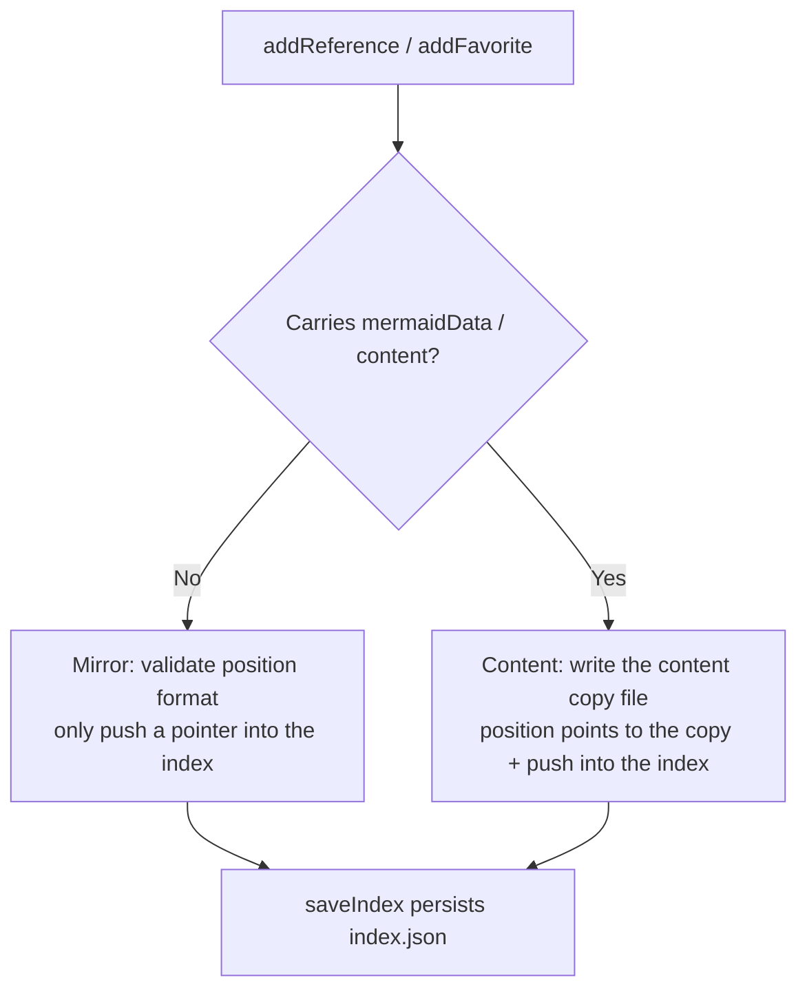

# library storage conventions (references / favorites)

> This file describes the **directory layout, `index.json` usage, data formats, and the two semantics Mirror/Content** of the `.fibo/library/` library, for the AI to understand before touching this storage (or explaining how it is used).
> The source of truth is the code: `backend/src/info/info.service.ts`, `backend/src/utils/info/info-manager.ts`, `backend/src/info/info.dto.ts`, `backend/src/utils/workspace-path-resolver.ts`. When this file disagrees with the code, the code wins.

## 1. What library is

`library` is the collection root of **artifacts the user actively curates**, landing under `<workspaceRoot>/.fibo/library/`, sitting alongside the machine-auto-generated `.fibo/analysis/` (analysis artifacts):

- `analysis/` — the mirror `info.md` produced by machine analysis (auto-generated by the system, the authoritative source of truth).
- `library/` — the things a human picks out to keep, hosting two sub-libraries:
  - `library/references/` — the **reference library**, storing concept graphs (ConceptGraph).
  - `library/favorites/` — the **favorites**, storing documents (Document).

The path constants are uniformly derived by `WorkspacePathResolver.getReferencesDir / getFavoritesDir`; **reassembling paths inside a service is strictly forbidden**.

## 2. Directory layout

```
<workspaceRoot>/.fibo/library/
├── references/
│   ├── content/                 # Only the Content (copy) type lands files here
│   │   └── <mermaid_id>.mermaid.json
│   └── index.json               # Reference-library index (JSON array)
└── favorites/
    ├── content/
    │   └── <uuid>.document.md
    └── index.json               # Favorites index (JSON array)
```

## 3. The two semantics: Mirror (pointer) vs Content (copy)

Each index item has a `type` field (`ItemType`, defined in `info.dto.ts`: `'Mirror' | 'Content'`) that decides where the data is stored and read from:

| Dimension | Mirror (internal source / pointer) | Content (external source / copy) |
| --- | --- | --- |
| Trigger | The curated object already has a mirror backing file in `analysis/` | AI-generated on the fly / manually created, no backing file |
| Lands a file in `content/` | **No**, only stores a pointer in the index | **Yes**, writes the whole content as a copy file |
| `position` form | `.fibo/`-relative mirror path, e.g. `analysis/a/b/c.py.info.md` (concept graph carries `:seq`) | `.fibo/`-relative copy path, e.g. `library/references/content/<id>.mermaid.json` |
| Read exit | `InfoManager.findDocument / findGraph` goes back to the `analysis/` mirror to fetch | Reads the copy file under `content/` directly |
| storageKind | Read always stamped `mirror` | Read/return always stamped `content-copy` |



## 4. `index.json` usage (lifecycle)

`index.json` is a **JSON array**, each element is an index item. All reads and writes go through `InfoService`; do not hand-edit the file.

- **Read (`getAllReferences` / `getAllFavorites`)**: lazy creation — when the file does not exist, auto `mkdir -p` and write an empty array `[]` then return; after reading, sort by `timestamp` descending (newest first).
- **Add (`addReference` / `addFavorite`)**: generate a UUID; split into Mirror/Content by whether content is carried (see §3); Content writes the copy file first then pushes; finally rewrites the whole index.json. The Content branch returns `storageKind: 'content-copy'`.
- **Delete (`deleteReference` / `deleteFavorite`)**: remove from the array by `id`; if Content, use `WorkspacePathResolver.resolveFiboRelative(workspaceRoot, position)` to locate and `unlink` the copy file.
- **Update (`updateReferenceContent` / `updateFavoriteContent`)**: **only the Content type** can have its content changed, rewrite the copy file, optionally change `name`; Mirror content must go through the mirror-directory update interface.
- **Detail (`getReferenceDetail` / `getFavoriteDetail`)**: Content reads the copy file; Mirror goes back to the `analysis/` mirror via `InfoManager` to fetch.

> Key invariant: the physical location of the copy file under `content/` = `resolveFiboRelative(position)`. So the `position` string (assembled in `addReference`/`addFavorite` with `upath.join('library','references'|'favorites','content',fileName)`) and the physical directory derived by `getReferencesDir/getFavoritesDir` **must always stay consistent**, otherwise you can write but not read.

## 5. Data formats

### 5.1 Index item (`ReferenceIndexItem` / `FavoriteIndexItem`)

```json
{
  "id": "550e8400-e29b-41d4-a716-446655440000",
  "name": "Custom authentication flow",
  "type": "Content",
  "position": "library/references/content/custom-auth-flow.mermaid.json",
  "timestamp": 1717900000000
}
```

### 5.2 Reference-library copy `<mermaid_id>.mermaid.json`

Follows `ConceptGraph` (`info.dto.ts`):

```json
{
  "mermaid_id": "custom-auth-flow",
  "mermaid_code": "graph TD\n  A-->B",
  "mermaid_info": { "name": "Custom authentication flow", "nodes": [] },
  "timestamp": 1717900000000,
  "position": "library/references/content/custom-auth-flow.mermaid.json",
  "storageKind": "content-copy"
}
```

### 5.3 Favorites copy `<uuid>.document.md`

Plain document body (a Markdown string), no extra wrapping. On read (`getFavoriteDetail`), the backend stamps `storageKind='content-copy'` and wraps it into a `DocumentData` to return.

## 6. Self-check points

- When changing the library physical paths, `getReferencesDir/getFavoritesDir` and the `position` assembly string in `addReference/addFavorite` **must be changed together** (the §4 invariant).
- position is always `.fibo/`-relative, **without the projectName prefix**; Content points to the copy, Mirror points to the `analysis/` mirror.
- The favorites copy extension is `.document.md` (not `.info.md`).

---
name: library storage conventions

update-time: 2026-06-30 04:36

description: Describes the directory layout, the index.json read/write lifecycle, the two semantics Mirror pointer vs Content copy, and the data formats of .fibo/library/ (references reference library + favorites), for the AI to understand before touching this storage; the source of truth is info.service.ts / info-manager.ts / info.dto.ts / workspace-path-resolver.ts

---
