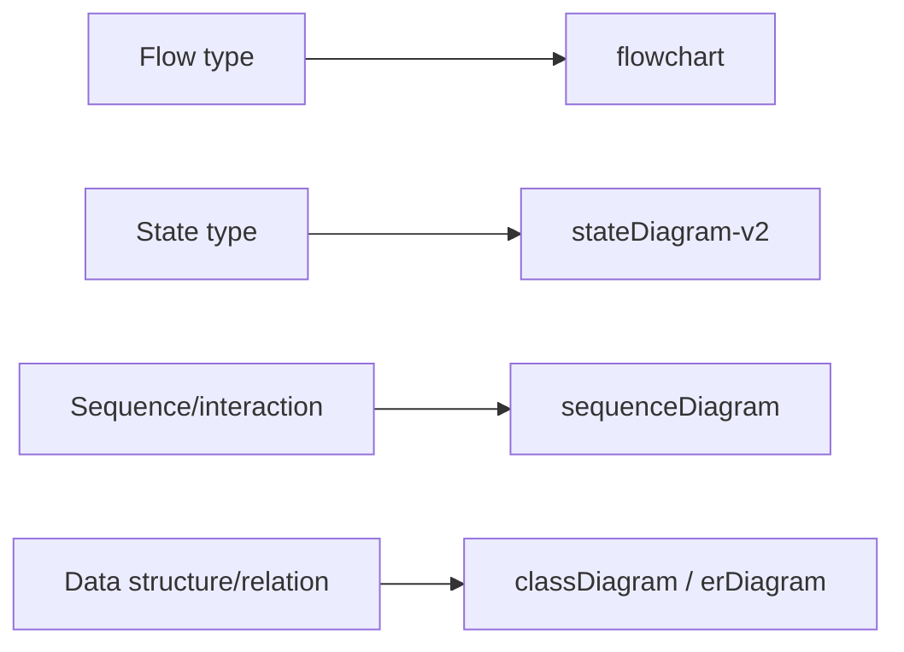
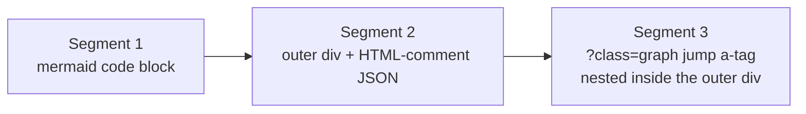
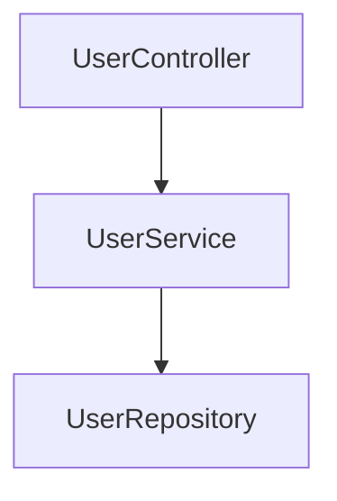
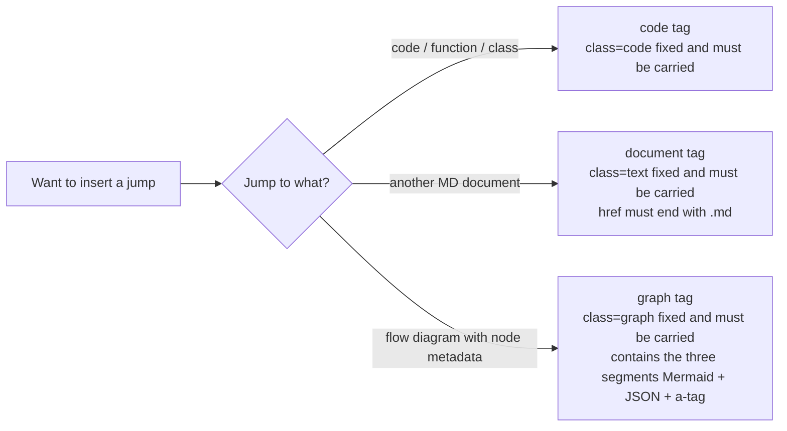

# Markdown Document Writing Conventions

> This file is part of the `fibo-conventions` skill. **All scenarios of writing / modifying MD documents** must obey every clause in this file.
> The anti-patterns are collected in `references/anti-patterns.md`; this file keeps a representative anti-pattern embedded in each section.

## 0. Unified structure of MD artifacts

Whenever you generate or update a `.md` file — whether spec / design / plan / report / ADR, or Markdown generated from `.info.md` / `.document.md` / `*.template.md` — the end must carry the unified meta-info block:

```
---
name: {document display name}

update-time: {YYYY-MM-DD HH:mm}

description: {a one-sentence description of this content, for retrieval and location}

---
```

Mandatory constraints:
- The three fields `name` / `update-time` / `description` are all required.
- `update-time` must take the operating system's real time at generation / update, in the format `YYYY-MM-DD HH:mm`.
- `description` is one sentence summarizing the topic and scope, it cannot be left blank.
- The meta-info block is fixed at the very end of the document body; if that artifact type also requires a `----------` terminator, the meta-info block goes before the `----------`.
- Inside the meta-info block, each of `name`, `update-time`, `description` must keep one blank line below it; the line below `description` must also be blank before writing the closing separator `---`, ensuring clearer display; ordinary body paragraphs are not required to add an extra blank line per paragraph.

## 1. Key logic must be expressed with Mermaid

**Scope (important)**: this rule **applies only to the scenario of "generating / modifying MD documents"**. Everyday conversation replies, terminal output, code comments, commit messages, etc. **do not need Mermaid**; answer with normal text.

In an MD document, any "key logic" such as a flow, state transition, call chain, module dependency, data flow, etc. **must not be listed as text only**; it must be accompanied by a Mermaid diagram.

Type selection:



Writing requirements:
- Node naming must be semantic, avoid meaningless symbols like `A/B/C` (unless a pure schematic diagram)
- Write branch conditions on the edge: `A -->|condition| B`
- Split complex diagrams into multiple, keep node count per diagram ≤ 15 where possible

---

## 2. General path convention (common to code / MD references, a rule)

Whether a code jump tag or an MD document cross-reference tag, all `href` and visible tag text **must obey** the following rules:

- **Must use a relative path**: every path in `href` is relative to the **project root**
- **Does not start with `/`**: write `src/services/UserService.ts` directly, `/src/services/UserService.ts` is forbidden
- **No absolute paths**: `C:/...`, `D:/...`, `/Users/...` or any absolute path is forbidden
- **Tag text must use the full relative path**: cannot write only the filename or directory name
- **Fixed anchor format**: `href` starts with `#`, followed by the relative path, then optionally appends `:line`, `:startLine-endLine`, or `:seq`, and finally `?class=xxx`

Correct examples:
- ✅ `href="#src/services/UserService.ts?class=code"`
- ✅ `href="#src/services/UserService.ts:45-67?class=code"`
- ✅ Tag text: `Code: src/services/UserService.ts`

Anti-examples (all forbidden):
- ❌ `href="/src/services/UserService.ts?class=code"` (starts with `/`)
- ❌ `href="#C:/project/src/services/UserService.ts?class=code"` (absolute path)
- ❌ Tag text: `Code: UserService.ts` (filename only)
- ❌ Tag text: `Document: services` (directory name only)

---

## 3. Code jump tag style

When a document references a code file / class / function / line range, you **must use the unified code jump tag**; bare paths are not allowed.

Standard template:

```html
<div style="display: flex; align-items: flex-end;">
    <span style="background-color: var(--tag-code-bg); margin: 8px 0 8px 14px; padding: 6px 12px; border-radius: 4px; border-left: 4px solid var(--tag-code-border); color: var(--tag-code-fg); font-size: 14px; font-weight: 500;">
        <a target="_self" href="#{relative-path}?class=code" style="color: inherit; text-decoration: none;">
            Code: {relative-path}
        </a>
    </span>
</div>
```

Variant with line numbers:

```html
<a target="_self" href="#{relative-path}:{startLine}-{endLine}?class=code" style="color: inherit; text-decoration: none;">
    Code: {relative-path}:{startLine}-{endLine}
</a>
```

A single-line anchor must use `:{line}`, do not write it as `{line}-{line}`:

```html
<a target="_self" href="#{relative-path}:{line}?class=code" style="color: inherit; text-decoration: none;">
    Code: {relative-path}:{line}
</a>
```

Mandatory constraints (`class` is the immutable trait of this tag):
- **The `class` value is fixed as `code`**: it must not be written as `function`, `method`, `type`, or any other value
- **`class=code` must be carried**: omitting `?class=code` in `href` is **forbidden**; an `href` with no query parameter is deemed illegal
- **The path still obeys §2 of this file**

Anti-examples:
- ❌ `href="#src/services/UserService.ts"` (missing `?class=code`)
- ❌ `href="#src/services/UserService.ts?class=function"` (illegal class value)
- ❌ `href="#src/services/UserService.ts?type=code"` (wrong parameter name)

### 3.1 Anchor forms and the "reference" principle

Anchors (line numbers) are a **reference index**, they are not guaranteed to match the code's current state exactly:

| Anchor form | Writing | Priority | Applicable |
| --- | --- | --- | --- |
| Line range | `src/foo.ts:120-155` | **Primary (preferred)** | All implementation anchors pointing to a function / class / algorithm segment use this |
| Single line | `src/foo.ts:45` | Primary | Pointing to a key line (magic constant, key if-branch, etc.) |
| Whole file | `src/foo.ts` | Fallback | When the whole file is the implementation location, the line number can be omitted |

**Rule — index uncertainty**:
- Anchors are **for reference only**; if while reading you find the anchor points to a location inconsistent with the context description, you **should reverse-update the anchor** (fix the doc) rather than trust the old anchor
- **When code vs docs disagree, code wins**: if you find the implementation detail described in the doc inconsistent with the current code, change the doc per the current code, not the other way around
- Do not update anchors frequently for the sake of precision — only fix them along the way while reading / changing / committing (see `commit-sync.md`)
- **The `#symbolName` form is forbidden** (e.g. `src/foo.ts#parseConfig`): this project anchors uniformly by line number

---

## 4. MD document cross-reference tag style

When a generated MD needs to reference **another MD document**, use the document jump style (strictly distinguished from the code jump tag via `class`), and **the file suffix in `href` must be `.md`**.

Standard template:

```html
<div style="display: flex; align-items: flex-end;">
    <span style="background-color: var(--tag-text-bg); margin: 8px 0 8px 14px; padding: 6px 12px; border-radius: 4px; border-left: 4px solid var(--tag-text-border); color: var(--tag-text-fg); font-size: 14px; font-weight: 500;">
        <a target="_self" href="#{relative-path}.md?class=text" style="color: inherit; text-decoration: none;">
            Document: {relative-path}.md
        </a>
    </span>
</div>
```

Mandatory constraints (`class` is the immutable trait of this tag):
- **The `class` value is fixed as `text`**: it must not be written as `md`, `doc`, `markdown`, or any other value
- **`class=text` must be carried**: omitting `?class=text` in `href` is **forbidden**; an `href` with no query parameter is deemed illegal
- **`href` must end with `.md`**: even when referencing a directory summary or a section anchor, it must land on a concrete `.md` file
- **The path still obeys §2 of this file**

The tag text uniformly uses `Document: ` as the prefix, followed by the full relative path (ending in `.md`).

Correct examples:
- ✅ `Document: docs/api/UserService.md`
- ✅ `Document: docs/services/index.md`
- ✅ `Document: docs/design/auth-design.md`

Anti-examples:
- ❌ `href="#docs/api/UserService.md"` (missing `?class=text`)
- ❌ `href="#docs/api/UserService.md?class=md"` (illegal class value)
- ❌ `href="#docs/api/UserService"` (missing `.md` suffix)
- ❌ `href="#docs/api/UserService.html?class=text"` (suffix is not `.md`)
- ❌ Tag text: `Document: UserService.md` (missing the full relative path)
- ❌ Tag text uses a localized or non-standard prefix (e.g. `File details: xxx`, `Design doc: xxx`); only the standard English prefixes are allowed

---

## 5. Flow-diagram tag style

When a document needs to show a flow diagram whose **nodes point to specific files at specific line numbers** (nodes carry jumps / contain code or document references), you **must use the unified flow-diagram tag**; a bare Mermaid code block must not be placed in the document.

### 5.1 Trigger conditions

Meeting any of the following requires the graph tag:
- A flow-diagram node needs to jump to code (a whole file or a specific line range)
- A flow-diagram node needs to jump to another MD document
- Multiple nodes within the same flow diagram have cross-file / cross-section reference relations

Pure schematic diagrams (all nodes are abstract concepts, no jump needs) are not required to use it; the bare Mermaid of §1 can be used directly.

### 5.2 Overall tag structure

The graph tag is made of **three segments**, in a fixed order that cannot be missing:



Full template (**the a-tag is nested inside the outer div**):

````markdown


<div id="src/services:1">
<!-- {
    "mermaid_info": {
        "name": "User service architecture",
        "nodes": [
            { "id": "user_controller_001", "name": "UserController", "path": "src/controllers/UserController.ts", "hint": "User controller entry", "isJumpable": true, "position": { "startLine": 10, "endLine": 50 }, "references": [] },
            { "id": "user_service_002", "name": "UserService", "path": "src/services/UserService.ts", "hint": "User business logic", "isJumpable": true, "position": { "startLine": 15, "endLine": 150 }, "references": [] },
            { "id": "user_repo_003", "name": "UserRepository", "path": "src/repositories/UserRepository.ts", "hint": "User data-access layer", "isJumpable": true, "position": { "startLine": 8, "endLine": 80 }, "references": [] }
        ]
    }
} -->
<div style="display: flex; align-items: flex-end; margin-top: 12px;">
    <span style="background: var(--tag-graph-bg); margin: 8px 0 8px 14px; padding: 6px 12px; border-radius: 4px; border-left: 4px solid var(--tag-graph-border); color: var(--tag-graph-fg); font-size: 14px; font-weight: 500;">
        <a target="_self" href="#src/services:1?class=graph" style="color: inherit; text-decoration: none;">
            Graph: src/services:1
        </a>
    </span>
</div>
</div>
````

### 5.3 Mandatory constraints

- **The `class` value is fixed as `graph`**: it must not be written as `flowchart` / `diagram` / `mermaid` or any other value
- **`class=graph` must be carried**: omitting `?class=graph` in `href` is forbidden; an `href` with no query parameter is illegal
- **The three segments are in a fixed order and cannot be missing**: Mermaid block → outer div (JSON comment + embedded a-tag) → outer div close
- **The outer div must have `id="{relative-path}:{seq}"`**: seq increments from `1` under the same relative path
- **The `href` anchor `{relative-path}:{seq}` must match the outer div's `id` character-for-character**
- **The path still obeys §2 of this file** (relative path, not starting with `/`)

Anti-examples:
- ❌ `href="#src/services:1"` (missing `?class=graph`)
- ❌ `href="#src/services:1?class=flowchart"` (illegal class value)
- ❌ Missing the Mermaid code block, only div + JSON (one of the three segments missing)
- ❌ Outer div `id="src/services:1"` but the a-tag href `#src/services:2?class=graph` (id ↔ href mismatch)

### 5.3.1 graph tags in ordinary hand-written `.md` documents: ref must bind to this document

When inserting a graph tag in an **ordinary `.md` document hand-written by a human / AI** (not carrying a program-generated suffix like `.info.md` / `.document.md`), additionally obey:

- **`{relative-path}` must be the relative path of "the current document that carries this Mermaid diagram itself"**, not the analyzed source-code path, nor any other document path
- **`{seq}` is the occurrence number of this diagram **within this document**** (incrementing from `1` in the order graph tags appear, consistent with §5.2)
- **Render source = the nearest ```mermaid code block above this tag**: after clicking the tag you enter Graph view, the system takes the ```mermaid block **above, and nearest to** the tag's position in the document as the render content, and uses the `nodes` in this tag's JSON comment to provide node jumps

> Why binding to this document is enforced: an ordinary `.md` has no backend `.info.md` mirror, so after clicking it does not go through mirror retrieval but parses "this document's raw content + the nearest mermaid above" in place. If `{relative-path}` is filled with another document / source-code path, the render source is still located by this document's seq, but the ref semantics are detached from the document itself, breaking the traceability of "tag ↔ the document it lives in".

Anti-examples:
- ❌ In an ordinary `.md`, the graph tag's `{relative-path}` points to the analyzed source code (e.g. `src/foo.ts:1`) or another document, rather than the current document's own path
- ❌ In an ordinary `.md`, two diagrams of the same document both use `:1` (the seq does not increment by appearance order)
- ❌ Above the graph tag there is no ```mermaid code block anywhere in this document (clicking will prompt "no renderable flow diagram found")

### 5.4 Mermaid code generation rules

**Diagram-type selection**:

| Purpose | Type |
| --- | --- |
| Component / module dependency relations | `graph TD` / `graph LR` |
| Layered structure (with subgraph grouping) | `flowchart TD` + `subgraph` |
| Sequence / interaction | `sequenceDiagram` |
| State transition | `stateDiagram-v2` |

**Node ID naming convention (rule)**:

- **Format**: `{semantic-English-identifier}_{NNN}`, where `NNN` is a **three-digit number**
- **Numbering rule**: each diagram numbers **independently** starting from `_001`, incrementing by the order of the node's **first appearance** in the Mermaid code (`_001`, `_002`, `_003`...)
- **Fixed to 3 digits**: `_01`, `_1` and other short forms are not allowed; beyond 999 nodes the diagram should be split
- **Node IDs must be globally unique within each diagram**
- **No random-character suffixes**: like `_a1b`, `_x2y`, `_xxx` (**the key difference from the old rule** — the old rule required random characters, now uniformly changed to incrementing numbers to guarantee the JSON-to-Mermaid node correspondence does not clash)
- **No non-semantic IDs**: like `A` / `B` / `node1` / `temp`
- **Node labels must be wrapped in quotes**: `user_service_001["UserService"]`, `user_service_001[UserService]` is not allowed

**Edge writing**:

- Write conditions on the edge: `A -->|condition| B`
- Keep node count per diagram ≤ 15 where possible, split beyond that

Correct examples:
- ✅ `user_controller_001["UserController"] --> user_service_002["UserService"]`
- ✅ `auth_module_001["Auth module"] -->|login request| session_module_002["Session module"]`

Anti-examples:
- ❌ `user_controller_a1b["UserController"]` (random suffix)
- ❌ `user_controller_01["UserController"]` (suffix fewer than 3 digits)
- ❌ `user_controller["UserController"]` (missing `_NNN` suffix)
- ❌ `A["UserController"] --> B["UserService"]` (non-semantic ID)
- ❌ `user_controller_001[UserController]` (label missing quotes)

### 5.5 Node-info JSON convention

The JSON must be placed in the HTML comment (`<!-- ... -->`) inside the outer div, structured:

```json
{
  "mermaid_info": {
    "name": "<human-readable name of this diagram>",
    "nodes": [ /* one object per node, fields see the table below */ ]
  }
}
```

**Node field definitions** (all required):

| Field | Type | Semantics |
| --- | --- | --- |
| `id` | string | **Must** match the Mermaid node ID character-for-character (incl. the `_NNN` suffix) |
| `name` | string | **Must** match the Mermaid node label character-for-character |
| `path` | string | Relative path, obeys the §2 general convention; may be `""` when `isJumpable=false` |
| `hint` | string | One-line description of the node's function, no subjective words ("friendly" / "reasonable" / "fast") |
| `isJumpable` | boolean | Whether it is jumpable; see §5.6 |
| `position.startLine` | int | Start line number; a directory-level whole-file node writes `1`; writes `0` when `isJumpable=false` |
| `position.endLine` | int | End line number; a single-line node `=startLine`; writes `0` when `isJumpable=false` |
| `references` | array | Reference list, keep `[]` when there is none (**cannot be omitted**, backend normalize relies on this field existing) |

Anti-examples:
- ❌ JSON missing the `references` field (must be `[]` even with no references)
- ❌ JSON `id="user_service_001"` but the Mermaid code writes `user_service_002` (id character mismatch)
- ❌ `hint="the user-friendly service"` (contains the subjective word "friendly")

### 5.6 Descriptive nodes (`isJumpable=false`)

Flow diagrams often have nodes with no corresponding code / document source, such as **external actors, user actions, third-party systems, abstract stages**; these nodes use `isJumpable=false`:

```json
{
  "id": "external_user_001",
  "name": "End user",
  "path": "",
  "hint": "The external actor that triggers the login request",
  "isJumpable": false,
  "position": { "startLine": 0, "endLine": 0 },
  "references": []
}
```

Constraints:

| State | `path` | `position.startLine` | `position.endLine` |
| --- | --- | --- | --- |
| `isJumpable=true` | **Must** be a non-empty legal relative path | **Must** ≥ 1 | **Must** ≥ `startLine` |
| `isJumpable=false` | May be `""` | **Must** be `0` | **Must** be `0` |

Anti-examples:
- ❌ `isJumpable=true` but `path=""` (self-contradictory)
- ❌ `isJumpable=true` but `position.startLine=0` (self-contradictory)
- ❌ `isJumpable=false` but `path="src/foo.ts"` (should change to `true` or clear the path)

### 5.7 Collected anti-examples

- ❌ A Mermaid code block placed bare in the document, without the outer div + JSON comment (one of the three segments missing)
- ❌ `href` missing `?class=graph`
- ❌ `href` class written as `class=flowchart` / `class=mermaid` etc.
- ❌ Node ID with a random-character suffix (e.g. `_a1b` / `_x2y` / `_xxx`)
- ❌ Node ID suffix fewer than 3 digits (e.g. `_01`)
- ❌ Node ID missing the `_NNN` suffix (e.g. `user_service`)
- ❌ Two `user_service_001` in the same diagram (duplicate ID)
- ❌ The outer div's `id` mismatches the a-tag `href` anchor
- ❌ Node JSON missing the `references` field
- ❌ A JSON node's `id` or `name` mismatches the Mermaid code character-for-character
- ❌ `isJumpable=true` but `path=""` or `position.startLine=0`

---

## 6. Jump-target cheat sheet



**`class=code` → jump to code; `class=text` → jump to an MD document; `class=graph` → jump to a flow diagram with node metadata. The three classes are not interchangeable, not omittable, not rewritable.**

---
name: Markdown Document Writing Conventions

update-time: 2026-07-01 05:57

description: The rules for writing / modifying any MD document: every generated MD must carry a name/update-time/description meta-info block at the end, keep one blank line below each of the three meta-info fields (incl. after description), key logic must use Mermaid, paths are relative and do not start with /, the class of the three jump tags code / document / graph is enforced

---
