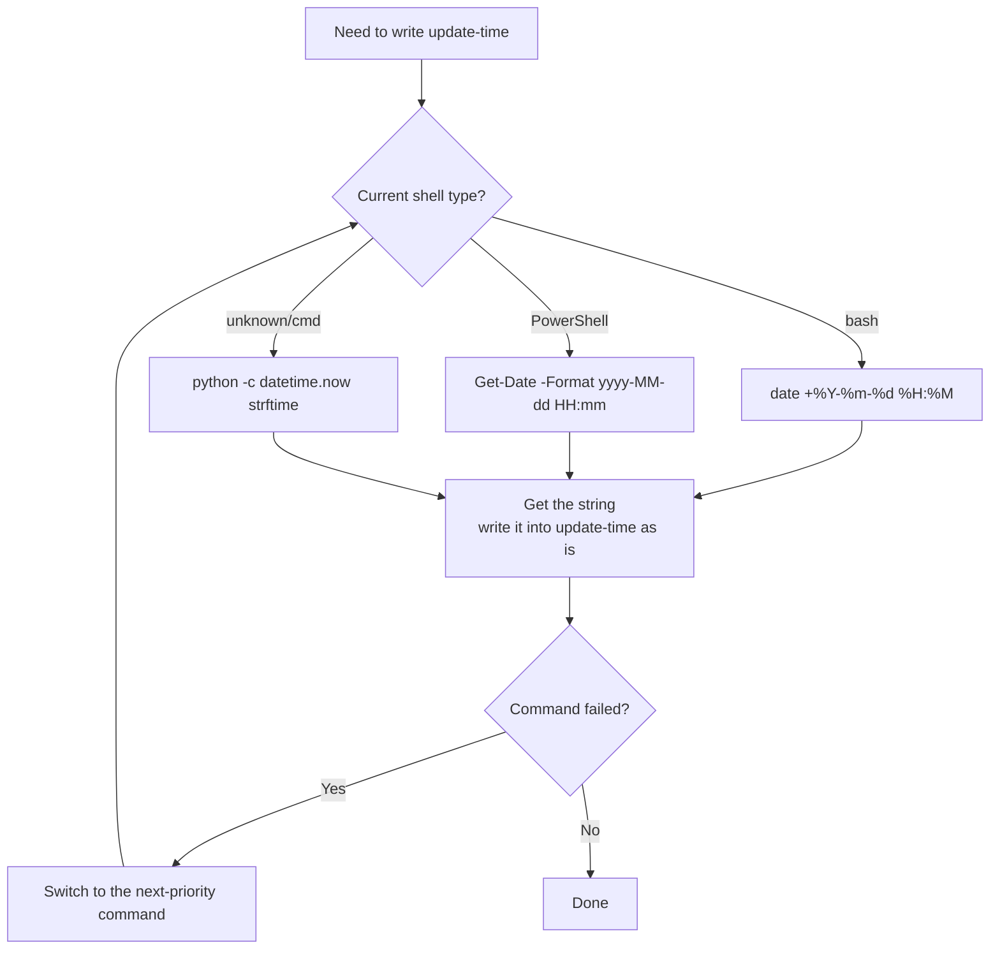
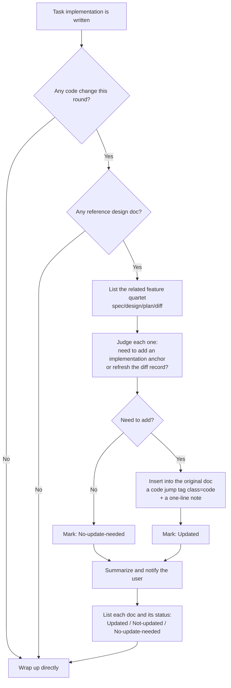
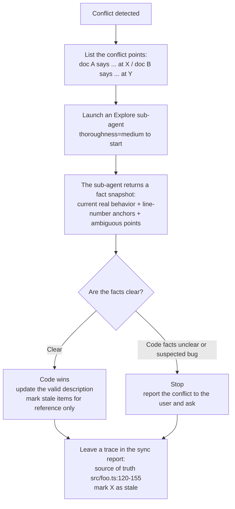

# Reverse sync between design docs and code (rules)

> This file is part of the `fibo-conventions` skill. It must be obeyed **at task wrap-up when this round touched code**.
> For the batch sync flow dual-triggered by commit / sync-only see `commit-sync.md`.

## 1. Trigger conditions and the "code wins" principle

As long as this task **simultaneously satisfies** the following two, reverse sync must be executed:

1. The task has one or more **reference design docs** (MD documents the user provided in conversation, or explicitly referenced in the code)
2. This task **actually modified / added code**

The `.fibo/docs/specs/<feature>/{spec,design,plan,diff}.md` quartet corresponding to this round's code change is treated as a reference design doc; as long as the feature directory can be uniquely located from the plan / spec / current task context, the user does not need to mention each explicitly this round.

**Core principle — when code vs docs disagree, code wins and the doc is updated in sync**:
- If during reverse sync you find that a description in spec / design / plan / diff / ADR is inconsistent with the current code behavior, **fix the doc to match the code facts**, do not change the code in reverse
- If an old spec / design / plan / diff lags behind, or conflicts with other specs / diffs, and the current code facts are clear, code wins, and mark the stale entry "stale, for reference only"
- If the code facts are unclear, the implementation seems like a bug, or you cannot judge whether the current behavior is stable, you should stop and report to the user; do not silently change the doc to paper over the problem
- Discriminating principle: **code facts clear** (parameter names, filenames, call paths, anchor line numbers, current real business behavior) → update the doc per the code and mark stale items; **code facts unclear / suspected bug** → confirm with the user first

### 1.1 Sync-target whitelist (crossing it is strictly forbidden)

Only the following kinds of MD documents **can** be targets of reverse sync:

| Type | Meaning |
| ---- | --------------------------------------------------------- |
| User docs | MD documents the user explicitly mentioned / gave a path to **in the current session** |
| AI-generated docs | MD documents the assistant created or modified **during the current session** |
| `.fibo/docs/specs/<feature>/{spec,design,plan,diff}.md` | The quartet **functionally corresponding** to this round's code change, treated as an implicit sync target (no explicit user mention needed); sync it if it exists, and if it is missing but `diff.md` can be generated from the real diff, it must be generated |

**Absolutely forbidden**:
- ❌ Do not scan "seemingly related" MD documents in the repo and add anchors on your own
- ❌ Do not touch documents mentioned in a historical session but not in this session
- ❌ Do not modify unrelated documents such as README, CHANGELOG, third-party dependency docs

---

## 2. Sync actions (only supplement / fix implementation details, do not change the business design)

**Primary target**: sync the `.fibo/docs/specs/<feature>/` quartet:

1. Backfill the code location into the "implementation location" area under the **corresponding AC entry** in `spec.md` using a code jump tag (`class=code`, see `markdown.md` §3), so AC ↔ code are presented side by side.
2. If `design.md` / `plan.md` already exist, fix implementation details, file paths, interface names, statuses, or task-reference drift per the current code.
3. If a real diff / patch / working-tree diff exists this round, you must call `fibo-recording-diff` to generate or refresh `diff.md`; fabricating hunks from memory is forbidden. If the feature directory cannot be located or the real diff cannot be obtained, mark `diff.md` as `Not-updated` in the sync report and explain the reason.

**Secondary target**: if the change belongs to cross-feature global design (e.g. adding a module, adjusting architecture), sync it to `.fibo/docs/architecture/<file>.md`; if it involves a new decision trade-off, create a new ADR under `.fibo/docs/decisions/`.

**Mandatory boundaries**:
- ✅ Allowed: **add / update** a code jump tag (implementation anchor) below an AC
- ✅ Allowed: fix implementation-detail descriptions in the doc inconsistent with the code, per the "code wins" principle
- ✅ Allowed: add a short one-line implementation note next to the tag
- ✅ Allowed: generate or refresh `diff.md`'s reading order, hunk explanations, and cross-file Mermaid main line from the real diff
- ✅ Allowed: when an old description conflicts with the current code facts, keep the old description and mark "stale, for reference only" nearby
- ❌ Forbidden: changing the existing chapter structure, heading levels, Mermaid diagrams, or AC business rules of the design doc
- ❌ Forbidden: deleting or rewriting a design description that has not become invalid
- ❌ Forbidden: adding content in the design doc that is not for the purpose of "implementation guidance"
- ❌ Forbidden: recording a hunk in `diff.md` that does not exist in the real diff / patch
- ❌ Forbidden: directly deleting a conflicting old AC / design decision / diff explanation to paper over historical context

**Clear purpose**: add clickable "design → implementation" anchors to the spec / design docs + fix implementation-detail drift, **not** rewrite the design.

### 2.1 Stale-item marking (for reference only)

When spec / design / plan / diff lags behind later, or when multiple docs give conflicting descriptions of the same behavior, interface, file path, task status, or hunk explanation:

1. First read the code to confirm the current facts; for a multi-file call chain, go through the §5 Explore sub-agent adjudication.
2. Once the code facts are clear, update the still-valid implementation anchors / notes with code as the truth.
3. For an old entry that no longer represents the current implementation, do not delete it, do not rewrite it into the new rule; append a stale mark nearby below that entry.

Fixed format:

```
> Stale, for reference only: the current implementation defers to `src/foo.ts:120-155`; the original description is kept for understanding historical context.
```

Mandatory constraints:
- `Stale, for reference only` must appear verbatim, for retrieval.
- You must give the code source of truth (file path, with the line number or range when it can be located).
- If the same stale item affects other docs, all affected docs must be marked in sync, not just one.
- The sync report must state which stale items were marked this round and the source of truth.

### 2.2 Update the meta-info mark (must add on every update)

After **completing** each generation or update of any `.md` document, you must append an update-meta-info block at the **very end** of that document.
The format is fixed: a `---` separator above and below, with the document attributes in between.

Standard template:

```

---
name: {document display name}

update-time: {YYYY-MM-DD HH:mm}

description: {a one-sentence description of this content, for retrieval and location}

---

```

Example:

```
---
name: Auth module design

update-time: 2026-06-30 04:36

description: The overall design of the auth module: source of login state, Token store/expiry strategy, AC ↔ code anchors

---

```

Mandatory constraints:
- **Position fixed at the very end of the document**: it must not be stuffed anywhere else in the text
- **When generating / updating any MD document, the three fields `name` / `update-time` / `description` are all required**, none can be missing
- **`update-time` takes the current real time**, do not fabricate or leave blank
- **`description` is one sentence** (suggested ≤ 60 chars), summarizing the topic and scope; used for retrieval / indexing / an agent's decision on "whether to read this doc"
- **Keep one blank line below each field**, i.e. one blank line below each of `name`, `update-time`, `description`; the line below `description` must also be blank before writing the closing separator `---`, for display and readability
- **Overwrite-refresh this block on every update** (i.e. each document keeps only the **latest** meta-info block, do not stack historical updates into multiple blocks)

### 2.3 Obtain system time across OSes (mandatory)

`update-time` must take the **operating system's current real time**; writing from memory is forbidden, and reusing a "today's date" given in conversation is forbidden.
Choose the corresponding command by the current shell / OS, in **priority**: bash → PowerShell → Python fallback.

| Environment | Command |
| ----------------------------------- | ------------------------------------------------------------------------------- |
| bash (Linux / macOS / Git Bash) | `date "+%Y-%m-%d %H:%M"` |
| PowerShell (native Windows) | `Get-Date -Format "yyyy-MM-dd HH:mm"` |
| cmd (native Windows, not recommended) | `powershell -Command "Get-Date -Format 'yyyy-MM-dd HH:mm'"` |
| any-OS fallback | `python -c "import datetime; print(datetime.datetime.now().strftime('%Y-%m-%d %H:%M'))"` |

Execution flow:



Mandatory constraints:
- **You must actually run** the above command to get the time, it is **not allowed** to directly write an unverified value like `2026-04-28 12:00`
- **The format must be precisely `YYYY-MM-DD HH:mm`**: year-month-day space hour:minute (24-hour, no seconds, no timezone)
- **Multiple updates to the same document in the same session**: re-run the command each time to get the current time, do not reuse the previous value

---

## 3. Mandatory self-check flow at task wrap-up

Before every task ends (i.e. before telling the user "done"), you must run a self-check per the diagram below:



---

## 4. Format for notifying the user

At task wrap-up you must give a **design-doc sync report**, in the following format:

```
Design-doc sync report:
- .fibo/docs/specs/auth-login/spec.md : Updated (added 2 implementation anchors under AC-1, AC-3 + fixed 1 interface name per the code)
- .fibo/docs/specs/auth-login/diff.md : Updated (refreshed the reading order and design logic of 3 files / 5 hunks based on the real working-tree diff)
- .fibo/docs/specs/auth-legacy/spec.md : Updated (marked AC-2 stale, for reference only; source of truth `src/auth/session.ts:120-155`)
- .fibo/docs/architecture/module-dependency.md : Not-updated (this round did not touch the global module dependency, add it at the next architecture adjustment)
- .fibo/docs/decisions/0003-token-store.md : No-update-needed (the decision itself is unchanged)
```

State enum (only these three, do not invent other states):

| State | Meaning |
| -------- | -------------------------------------------------- |
| Updated | This round did insert a code tag / implementation note in the doc |
| Not-updated | The doc **should** be supplemented but was **not** this round (a reason must be given) |
| No-update-needed | The doc is unrelated to this round's code change, or there is no supplementable implementation description |

> "Not-updated" must give a reason (e.g. waiting for user confirmation, the current implementation is not yet stable, the doc structure needs to be discussed first); **silently skipping is not allowed**.

---

## 5. Fact adjudication of inter-doc conflicts (must go through a sub-agent)

**Trigger conditions** (meeting any):
- During reverse sync you find **two or more** docs describing the same behavior / rule / interface inconsistently with each other
- A doc description is inconsistent with the code, and you **cannot directly judge the current code facts** (e.g. a multi-file call chain, complex branches)

**Handling flow**:



**Sub-agent task template** (fixed wording):

```
Task: investigate the code facts to adjudicate a doc conflict
Conflict points:
  - Doc A ({path}, section X) says: ...
  - Doc B ({path}, section Y) says: ...
Please read the relevant code and answer:
  1. What is the current real behavior?
  2. Key code anchors (with line ranges)
  3. Is there any ambiguity or possible bug
Read only, do not modify; do not change any file.
```

**Mandatory constraints**:
- ❌ Adjudicating from conversation history / memory is not allowed; you must actually launch an `Explore` sub-agent to read the code
- ❌ Skipping the trace is not allowed — the sync report must state the source of truth (e.g. "defers to `src/foo.ts:120-155`")
- ❌ When the code itself is in doubt, do not silently change the doc to paper over; stop and ask
- ✅ Default thoroughness=`medium`, use `very thorough` across multiple modules

---
name: Reverse-sync conventions between design docs and code

update-time: 2026-07-05 21:43

description: The task-wrap-up reverse-sync rules: code wins, sync the quartet and mark stale items

---
