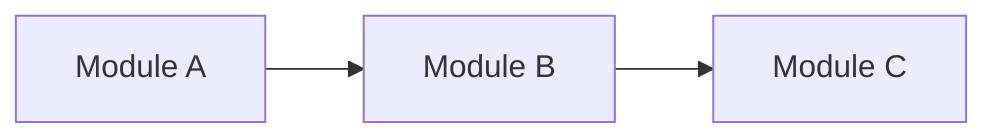
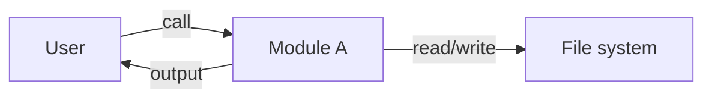

# {module/feature name} design doc

> **Purpose**: describe "how to do it" — goals, key decisions, file list, interface contracts, interaction with existing modules. It is the HOW layer, paired with the WHAT/WHY of spec.md.
> **Location**:
> - Single-feature internal design → `.fibo/docs/specs/<feature>/design.md` (or `design/<topic>.md` when complex)
> - Cross-feature global design → `.fibo/docs/architecture/<topic>.md`
>
> **Mandatory constraint**: in Section 2 "Key design decisions", **each decision** must be tagged at the end with `↔ AC-NN` (one or more, corresponding to the AC number in spec.md), realizing bidirectional design ↔ AC traceability. A decision paragraph with no AC attached is not allowed to be written.

## 1. Goal

A paragraph summarizing which AC in spec.md this design implements, why this design is needed (rather than writing code directly), and this round's boundaries (what is not done).

## 2. Key design decisions

### D1: {decision one-line title}

{decision explanation: why chosen this way, which alternatives were eliminated, key constraints. May contain a Mermaid flowchart.}



↔ AC-XX, AC-YY

### D2: {decision one-line title}

{...}

↔ AC-ZZ

> 💡 A major decision (affecting multiple features / changing the core architecture) should get its own ADR; this section only summarizes and links to it.

## 3. File list

**New**:

| Path | Purpose | Corresponding AC |
| --- | --- | --- |
| `path/to/new-file.md` | ... | AC-XX |

**Modified**:

| Path | Change | Corresponding AC |
| --- | --- | --- |
| `path/to/existing-file.md` | ... | AC-YY |

**Unchanged**: `path/a`, `path/b` (state why explicitly unchanged, to avoid accidental edits).

> 📌 This section is the basis for the commit-sync `design.md consistency check`: the paths declared "new/modified" in this section undergo a file-existence check at the commit-sync stage; missing means reporting `design.md: Updated (removed X)`.

## 4. Interface contracts

The inter-skill / inter-module communication methods. Can use a Mermaid call graph + table.



### 4.1 {Module A} interface

| Item | Content |
| --- | --- |
| Input | ... |
| Output | ... |
| Preconditions | ... |
| Failure modes | ... |

### 4.2 Data format (optional)

```markdown
{field format example}
```

## 5. Interaction with existing modules

| Existing module | Interaction | Impact |
| --- | --- | --- |
| `module-x` | ... | unchanged / add N lines / modified |

## 6. Related

<div style="display: flex; align-items: flex-end;">
    <span style="background: var(--tag-text-bg); margin: 8px 0 8px 14px; padding: 6px 12px; border-radius: 4px; border-left: 4px solid var(--tag-text-border); color: var(--tag-text-fg); font-size: 14px; font-weight: 500;">
        <a target="_self" href="#.fibo/docs/specs/<feature>/spec.md?class=text" style="color: inherit; text-decoration: none;">
            Document: .fibo/docs/specs/<feature>/spec.md
        </a>
    </span>
</div>

---

name: {module/feature name} design doc

update-time: {YYYY-MM-DD HH:mm}

description: {a one-sentence description of this design's core decisions and scope, for retrieval}

---
