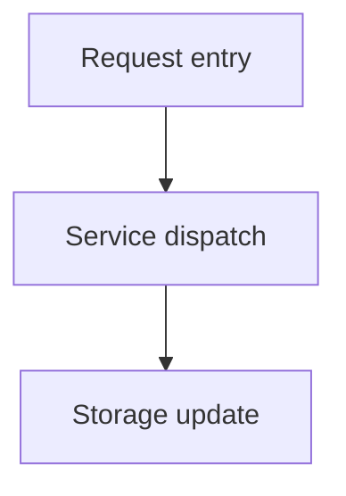

# Report reference-tag prompt (tagRule)

> This prompt is used to generate the investigation reports, research reports, codebase analysis reports, audit reports, performance reports, and retrospective reports under `.fibo/docs/reports/`.
> The report body has no fixed template; the AI should organize the content freely per the user's question; but wherever code logic, flow-diagram logic, code references, or document references are involved, this prompt must be obeyed.

## Conditions of use

- When referencing a code file, function, class, or line range, a code tag must be generated.
- When referencing a `.md` document, `.info.md`, `.document.md`, or an existing analysis document, a document tag must be generated.
- When adding a Mermaid architecture diagram, call-chain diagram, flowchart, state diagram, or sequence diagram in a report, a graph tag must be generated, preserving the Mermaid code block, node JSON comment, and graph tag in full.

## Multi-file report archiving rules

- When one investigation produces only 1 report, write it directly to `.fibo/docs/reports/{YYYY-MM-DD}-{topic}.md` (date prefix + topic, `{topic}-{YYYYMM}.md` is forbidden).
- When one investigation produces ≥ 2 reports, you must first create a `.fibo/docs/reports/{investigation-name}/` subdirectory (directory name without date), then place all report files in it.
- A multi-file report directory must contain a `README.md`, used to collect and summarize all report files produced by this investigation: explain the directory's purpose, list the files, and write a one-line summary for each; when adding a report later, this README must be updated in sync.

## Unified path rules

- All paths must be relative to the project root, not starting with `/`.
- Absolute paths are forbidden, e.g. `C:/...`, `D:/...`.
- Tag display text must show the full relative path, not just the filename.
- All `href` must start with `#`, and carry `?class=code`, `?class=text`, or `?class=graph`.

## code tag

Whole-file reference:

```html
<div style="display: flex; align-items: flex-end;">
    <span style="background-color: var(--tag-code-bg); margin: 8px 0 8px 14px; padding: 6px 12px; border-radius: 4px; border-left: 4px solid var(--tag-code-border); color: var(--tag-code-fg); font-size: 14px; font-weight: 500;">
        <a target="_self" href="#{relative-path}?class=code" style="color: inherit; text-decoration: none;">
            Code: {relative-path}
        </a>
    </span>
</div>
```

Line-number reference:

```html
<div style="display: flex; align-items: flex-end;">
    <span style="background-color: var(--tag-code-bg); margin: 8px 0 8px 14px; padding: 6px 12px; border-radius: 4px; border-left: 4px solid var(--tag-code-border); color: var(--tag-code-fg); font-size: 14px; font-weight: 500;">
        <a target="_self" href="#{relative-path}:{startLine}-{endLine}?class=code" style="color: inherit; text-decoration: none;">
            Code: {relative-path}:{startLine}-{endLine}
        </a>
    </span>
</div>
```

A single-line reference uses `:{line}`, do not write it as `:{line}-{line}`.

## document tag

```html
<div style="display: flex; align-items: flex-end;">
    <span style="background-color: var(--tag-text-bg); margin: 8px 0 8px 14px; padding: 6px 12px; border-radius: 4px; border-left: 4px solid var(--tag-text-border); color: var(--tag-text-fg); font-size: 14px; font-weight: 500;">
        <a target="_self" href="#{relative-md-path}?class=text" style="color: inherit; text-decoration: none;">
            Document: {relative-md-path}
        </a>
    </span>
</div>
```

Constraints:

- `relative-md-path` must end with `.md`; `.info.md` and `.document.md` are allowed.
- The tag text is fixed as `Document: {relative-md-path}`, a Chinese prefix is forbidden.

## graph tag

When adding a Mermaid diagram in a report, the graph's real path must bind to **the current report file that carries this diagram**:

- Single-file report: `.fibo/docs/reports/{YYYY-MM-DD}-{topic}.md:{seq}`
- Multi-file report: `.fibo/docs/reports/{investigation-name}/{file-name}.md:{seq}`
- `seq` is the occurrence order of the graph tag within that report file, incrementing from `1`.

Program-generated analysis artifacts such as `.info.md` can be generated per the real source-file / directory path rule of the corresponding analysis stage, but they too must be a real relative path; `TemporaryGraph/...` is forbidden.

The full structure must be three segments, in an immutable order:



<div id=".fibo/docs/reports/2026-07-09-repo-audit.md:1">
<!-- {
    "mermaid_info": {
        "name": "Codebase key flow",
        "nodes": [
            {
                "id": "request_entry_001",
                "name": "Request entry",
                "path": "backend/src/agents/memory/memory.service.ts",
                "hint": "Build the model context and inject codebase info",
                "isJumpable": true,
                "position": { "startLine": 152, "endLine": 173 },
                "references": []
            },
            {
                "id": "service_dispatch_002",
                "name": "Service dispatch",
                "path": "",
                "hint": "An abstract flow node in the report",
                "isJumpable": false,
                "position": { "startLine": 0, "endLine": 0 },
                "references": []
            },
            {
                "id": "storage_update_003",
                "name": "Storage update",
                "path": "backend/src/agents/memory/memory.service.ts",
                "hint": "Update the codebase-info storage",
                "isJumpable": true,
                "position": { "startLine": 379, "endLine": 383 },
                "references": []
            }
        ]
    }
} -->
<div style="display: flex; align-items: flex-end; margin-top: 12px;">
    <span style="background: var(--tag-graph-bg); margin: 8px 0 8px 14px; padding: 6px 12px; border-radius: 4px; border-left: 4px solid var(--tag-graph-border); color: var(--tag-graph-fg); font-size: 14px; font-weight: 500;">
        <a target="_self" href="#.fibo/docs/reports/2026-07-09-repo-audit.md:1?class=graph" style="color: inherit; text-decoration: none;">
            Graph: .fibo/docs/reports/2026-07-09-repo-audit.md:1
        </a>
    </span>
</div>
</div>

## Mermaid and node-JSON rules

- Mermaid code must be wrapped in a fenced code block whose info string is `mermaid`.
- The node ID format is `{semantic_name}_{NNN}`, each diagram numbering independently from `_001` in order of first appearance.
- Node labels must be wrapped in quotes, e.g. `request_entry_001["Request entry"]`.
- The JSON `id` and `name` must match the Mermaid node character-for-character.
- A JSON node must contain `id`, `name`, `path`, `hint`, `isJumpable`, `position`, `references`.
- When `isJumpable=true`, `path` must be a legal relative path, `position.startLine >= 1`, `position.endLine >= startLine`.
- When `isJumpable=false`, `path` must be an empty string, `position.startLine = 0`, `position.endLine = 0`.

## Error examples

- `href="#TemporaryGraph/repo-flow:1?class=graph"`
- `Graph: repo-flow:1`
- `Code: memory.service.ts`
- `href="#backend/src/agents/memory/memory.service.ts"`
- `href="#C:/Users/13909/Desktop/Fibo/backend/src/agents/memory/memory.service.ts?class=code"`

---
name: Report reference-tag prompt (tagRule)

update-time: 2026-07-09 00:14

description: The prompt rules for generating code / document / graph tags in reports and codebase analysis reports, the report single-file fixed {YYYY-MM-DD}-{topic} naming, and the rules for multi-file report directory archiving and README summarization

---
