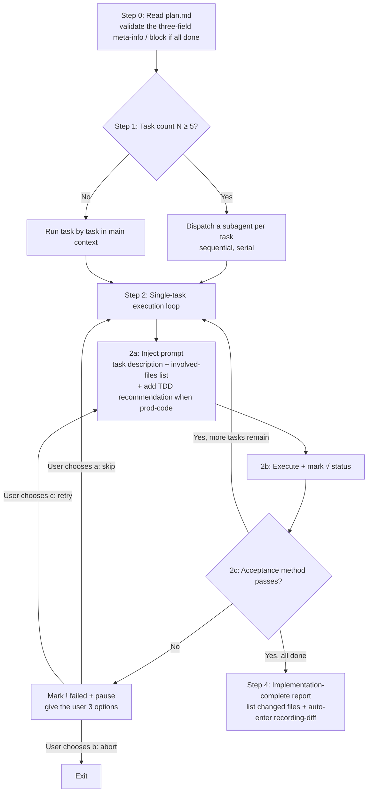
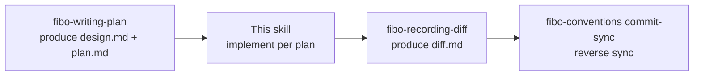

# Fibo executing-plan skill (executing-plan)

> This skill runs after plan.md is written to disk, implementing task by task in order.
> Input: `.fibo/docs/specs/<feature>/plan.md`
> Output: code changes + a dialogue report "implementation complete" + directly entering `fibo-recording-diff` to record the diff, then the user triggers commit-sync as needed

---

## When to use

✅ Applicable:
- The same directory has a signed-off `spec.md` + a `plan.md` generated by `fibo-writing-plan`
- plan.md has at least 1 task in `[×]` not-done state

❌ Not applicable:
- No plan.md → run `fibo-writing-plan` first
- All tasks in plan.md are `[√] done` → the task is already complete, no execution needed
- plan.md has `[!] failed` but the user hasn't indicated how to handle it → wait for the user's decision (do not retry on your own initiative)

---

## Core principles

1. **Tasks run in order, no concurrency**: to avoid file-write conflicts
2. **No dependency on git**: this project may not be a git repo; this skill does not do `status` / `diff` / `commit`
3. **Prompt-injected constraint, no post-hoc verification**: the constraint is enforced by writing the task's involved-files list + "do not modify files outside the list" into the executor prompt (per design D3)
4. **Pause on failure, no rollback**: on any task failure, stop immediately and let the user choose; do not auto-rollback completed tasks
5. **prod-code recommends TDD, others not enforced**: attach a TDD recommendation only when the task's tags include `prod-code`

---

## Main flow



---

## Step 0: Read plan.md + gate

1. Read `.fibo/docs/specs/<feature>/plan.md`
2. Validate: the trailing meta-info block contains the three fields `name` / `update-time` / `description`, and `update-time` is not a placeholder (whether the plan is signed off)
3. Validate: at least 1 task has status `[×]` (not done)
4. If not satisfied → exit + state the reason

---

## Step 1: Task-count decision for the subagent threshold

Read the "Task list" section of plan.md and count `### task-` lines = N.

- **N ≥ 5** → in Step 2, dispatch one Agent tool call per task (`subagent_type: general-purpose`), **sequential, serial** (no concurrency)
- **N < 5** → in Step 2, execute directly in the main context (avoiding subagent call overhead)

↔ AC-B2

---

## Step 2: Single-task execution loop

### 2a. Inject prompt

Whether in the main context or a subagent, the prompt the executor receives **must include**:

- The task's full description
- The **involved-files list** (exact paths + globs)
- The **hard-constraint sentence**: "Do not modify any file outside the list"
- If the task's tags include `prod-code`: append "It is recommended to first write a failing test (RED), then implement (GREEN), and finally clean up (REFACTOR), but it is not enforced"
- The spec.md / design.md paths (let the executor Read them itself, to avoid polluting the main context)
- **Code-comment convention reference**: the prompt must state explicitly "Follow the comment convention in §4 of `.claude/skills/fibo-conventions/references/conventions/code.md`; when a key decision is implemented / when a doc must be cited to explain intent, use the `spec:` / `design:` line format, and **the anchor path must be a full relative path** (e.g. `spec: .fibo/docs/specs/<feature>/spec.md#AC-X`); shorthand like `per spec.md AC-X` is forbidden, and isolated numbers like `task-09` / `D5` are forbidden; multiple `spec:` / `design:` references must each be on their own separate line, with one empty comment line kept between reference lines, to ensure the IDE mouse-hover tooltip displays them on separate lines". A subagent cannot access the main context's memory, so the rules must be written into the prompt explicitly

↔ AC-B3, AC-B4

### 2b. Execute + mark [√]

After the executor finishes, write back to plan.md: change that task's `status: [×]` to `status: [√]`.

### 2c. Acceptance

Run the task's "acceptance method" command (e.g. `ls -la <path>` / `grep "x" <path>`):

- Acceptance passes → move to the next task (or, if all are done, proceed to Step 4)
- Acceptance fails → mark `[!] failed`, proceed to Step 3 failure handling

↔ AC-B1

---

## Step 3: Failure handling (per design D5)

On any task failure → **do not continue, do not roll back**, give the user 3 options:

```
task-NN: <one-line title> failed
Reason: <subagent error / acceptance command did not pass / file cannot be written / ...>

Done: task-01, task-02 (code changes kept, not rolled back)
Not started: task-NN+1, task-NN+2, ...

Please choose one to continue:
(a) Skip task-NN and continue with task-NN+1 (accept an incomplete implementation)
(b) Abort the entire plan (keep completed task changes; call this skill again after you handle it)
(c) I have fixed it manually, retry task-NN
```

Continue only after the user chooses. **Do not act on your own initiative.**

---

## Step 4: All-done report

When all tasks have status `[√]`, output:

```
Implementation complete ✓
- Involved files: <deduplicated union of all tasks' involved files>
- Task count: N (all [√])

Next steps:
- Directly invoke fibo-recording-diff to generate .fibo/docs/specs/<feature>/diff.md, explaining hunk by hunk why this implementation is designed this way
- After diff.md is recorded, you may invoke commit-sync on the project to trigger reverse sync (per fibo-conventions/references/conventions/commit-sync.md)
- Or continue with the next feature
```

↔ AC-B5

---

## Mandatory constraints

- ❌ Do not run tasks concurrently (sequential, serial)
- ❌ Do not enter this skill while plan.md is unsigned
- ❌ Do not do post-hoc verification of file out-of-bounds (D3 already decided to rely on prompt constraint)
- ❌ Do not auto-rollback a failed task's code changes
- ❌ Do not run `git add` / `git commit` / `git push` in any task
- ❌ Do not force non-`prod-code` tasks to write tests
- ❌ On task failure, do not decide (a/b/c) for the user
- ✅ Allowed: write back the plan.md status field immediately after each task completes
- ✅ Allowed: reference the spec.md / design.md paths in the subagent prompt for it to self-read

---

## Handoff to other skills



- **fibo-writing-plan**: the upstream of this skill; this skill consumes its plan.md
- **fibo-recording-diff**: invoked directly after all tasks of this skill complete, to record the design-logic explanation of the real hunks; do not first ask the user whether diff.md needs to be generated
- **fibo-conventions**: after diff.md is recorded, the user may trigger its commit-sync flow

---
name: Fibo executing-plan skill

update-time: 2026-07-01 05:16

description: Implement serially per plan.md, then directly enter recording-diff after completion, then hand off to commit-sync

---
