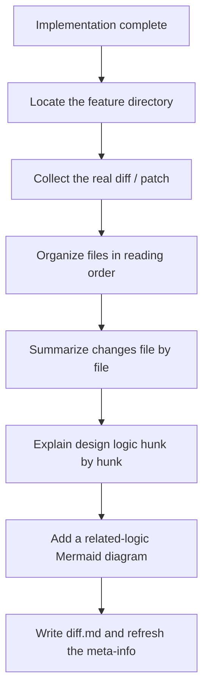

# Fibo diff-recording skill

> This skill, after implementation is complete, turns the real diff into `.fibo/docs/specs/<feature>/diff.md`.
> The goal is not to make a code-review checklist, but to let the user understand each changed file at two levels: first the file-level change summary, then every hunk's design logic along one coherent upstream-to-downstream main line.

---

## Overall flow



---

## Step 0: Gate

Before entering this skill, the following must be satisfied:

- `.fibo/docs/specs/<feature>/spec.md` already exists, and typically `design.md` / `plan.md` already exist in the same directory
- Implementation is already complete, code changes are wrapping up into reverse sync, or the user explicitly requests "record the current diff"
- A real diff source is obtainable: a patch provided by the user, a working-tree / staged diff, a commit diff, or the comparable changes listed by the previous step's executor

Handling when not satisfied:

- Cannot find the feature directory and cannot uniquely infer it from context → just ask the user which `.fibo/docs/specs/<feature>/` to record
- No real diff / patch → stop and explain that a hunk-level record cannot be generated; making up hunks from memory is forbidden
- The diff clearly conflicts with the spec's business intent → stop and report the conflict; do not generate a diff.md that papers over the problem

---

## Step 1: Read the conventions and the template

Before writing, you must read:

- The `fibo-conventions` resource `references/conventions/markdown.md`
- The `fibo-conventions` resource `references/conventions/docs-system.md`
- This skill's resource `references/diff.template.md`

When you need to write `update-time`, actually run the command to get the current system time per `fibo-conventions`' cross-OS rule.

---

## Step 2: Collect the real diff

Priority:

1. A patch / diff explicitly given by the user
2. The current repo's staged diff
3. The current repo's working-tree diff
4. The diff of a specified commit range
5. The per-file change material provided by the previous step's executor

Requirements:

- Only record changed files / hunks that actually exist
- Do not paste large chunks of raw diff into the document
- Every hunk must map to a `class=code` tag: a whole file uses `#path/to/file.ts?class=code`, a range uses `#path/to/file.ts:10-40?class=code`, a single line uses `#path/to/file.ts:42?class=code`; do not write a single line as `42-42`
- For a pure-deletion hunk, use a context line still present near the deletion location; when it cannot be located stably, point to the whole file and explain the reason

---

## Step 3: Determine the reading order

The file order of `diff.md` follows the order in which "the user understands the logic", not a mechanical arrangement by git output order.

Recommended ordering:

1. Entry / dispatch: user actions, command entries, event entries, public APIs
2. Contract / types: DTOs, interfaces, config, type definitions
3. Core logic: state, algorithms, business rules, data transforms
4. Adapter layer: backend services, storage, network, bridge layers
5. Presentation layer: UI components, interaction feedback, styles
6. Tests / docs / supporting config

If the real call chain differs from the order above, follow the call chain, and explain in the "reading order" table why it is read first.

---

## Step 4: Summarize each file, then explain hunk by hunk

For every changed file, write the file section in this fixed order:

1. **File role**: state where the file sits in the implementation main line, such as entry, contract, core logic, adapter, presentation, test, or supporting config
2. **File-level change summary**: aggregate the file's main behavioral, responsibility, contract, state-flow, or data-flow changes, using as many bullets or paragraphs as needed to make the meaning clear
3. **Hunk explanations**: explain the real hunks under that file with code anchors

The file-level summary is mandatory even when the file contains only one hunk. Keep the three levels distinct:

- File role explains **where the file participates** in the overall change
- File-level change summary explains **what changed across the file as a whole**
- Hunk explanations provide **the anchored design reasoning and context for each concrete change segment**

Do not impose a fixed word, sentence, paragraph, or bullet count on the file-level summary or on any hunk field. Write as much as needed to make the behavior, design reason, and context relationship unambiguous; stop when additional text would add no meaning. Avoid filler, repetition, and line-by-line restatement of the raw diff.

Do not turn the file-level summary into a list of line numbers, filenames, or hunk titles, and do not copy the hunk explanations verbatim. It must be a clear synthesis that lets the reader understand the file before drilling into individual hunks.

Each hunk subsection answers only what the user truly cares about:

- **What this change does**: describe the behavioral change of the code with enough detail to make its meaning clear, without restating the literal additions/deletions of the diff
- **Why it is designed this way**: explain why this hunk chose the current approach, and point out the avoided alternative when necessary
- **Context connection**: explain whose input it receives, whose subsequent logic it affects, and how it works with other hunks in the same file / across files

Do not write these fields by default:

- `Impact scope`
- `Review focus`
- `Verification method`
- Vague "note the tests" / "confirm no regression"

Unless the user explicitly requests a review checklist, `diff.md` is an explanation document, not a test plan.

---

## Step 5: Draw the related-logic view

When any one condition is met, a Mermaid + `class=graph` tag must be added:

- One behavior spans 2 or more files
- Multiple hunks jointly complete one state flow / call chain / data flow
- A hunk alone is hard to understand as to why this set of changes is needed

Tag rules for the diagram:

- Inside an ordinary `.md`, a graph tag's `id` / `href` must bind to the current `diff.md`'s own path, e.g. `.fibo/docs/specs/<feature>/diff.md:1`
- Mermaid node IDs use `{semantic_name}_{NNN}`, each diagram starting from `_001`
- JSON `nodes[].id/name` must be character-for-character identical to the Mermaid nodes
- Set `isJumpable=true` when a node can jump to code, and provide a relative path and line number; only at the abstract stage is `isJumpable=false`

---

## Step 6: Write and wrap up

When writing `.fibo/docs/specs/<feature>/diff.md`:

- Use the section skeleton of `references/diff.template.md`
- Inside every file section, keep the fixed order `File role → File-level change summary → Hunk explanations`
- Keep the `name/update-time/description` meta-info block at the end
- Write `description` as "records the reading order, file-level change summaries, hunk design logic, and cross-file relationships of this implementation diff"
- Do not modify `spec.md`'s AC, do not modify `design.md`'s design decisions, do not modify `plan.md`'s task status

After completion, report only:

```
diff record complete:
- Output: .fibo/docs/specs/<feature>/diff.md
- Covers: N files / M hunks
- Logic diagrams: K
```

---
name: Fibo diff-recording skill

update-time: 2026-09-08 04:31

description: Conventions for generating or refreshing a real-diff-based diff.md with a file-level change summary before each file's hunk explanations

---
