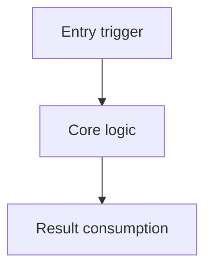

# {Feature display name} Diff record

> **Purpose**: record this implementation's real diff, explaining each hunk's design logic in the recommended reading order.
> **Location**: `.fibo/docs/specs/{feature-slug}/diff.md`
> **Boundary**: this document only explains implementation changes that have already happened; it does not add AC, does not rewrite design decisions, and does not replace plan status.

## 1. Reading order

| Order | File | Why read first | Related AC / task |
| --- | --- | --- | --- |
| 1 | `path/to/entry.ts` | The entry first establishes the trigger main line of this behavior | AC-XX / task-01 |
| 2 | `path/to/core.ts` | The core hunk explains the main state or rule change | AC-YY / task-02 |

## 2. Change main line

<!-- {
  "mermaid_info": {
    "name": "{Feature display name} diff change main line",
    "nodes": [
      { "id": "entry_001", "name": "Entry trigger", "path": "path/to/entry.ts", "hint": "The entry that triggers this implementation change", "isJumpable": true, "position": { "startLine": 10, "endLine": 40 }, "references": [] },
      { "id": "core_002", "name": "Core logic", "path": "path/to/core.ts", "hint": "The implementation location carrying the main design logic", "isJumpable": true, "position": { "startLine": 50, "endLine": 120 }, "references": [] },
      { "id": "output_003", "name": "Result consumption", "path": "path/to/output.ts", "hint": "The downstream location that consumes the core logic's result", "isJumpable": true, "position": { "startLine": 30, "endLine": 90 }, "references": [] }
    ]
  }
} -->

    
        <a target="_self" href="#.fibo/docs/specs/{feature-slug}/diff.md:1?class=graph" style="color: inherit; text-decoration: none;">
            Graph: .fibo/docs/specs/{feature-slug}/diff.md:1
        </a>
    

## 3. Hunk design logic

### 3.1 `path/to/entry.ts`

**File role**: {state which role this file plays in this diff's main line among entry, dispatch, contract, core logic, adapter layer, presentation layer.}

#### Hunk 1: {name it by design intent, not by writing "modified several lines"}

    
        <a target="_self" href="#path/to/entry.ts:10-40?class=code" style="color: inherit; text-decoration: none;">
            Code: path/to/entry.ts:10-40
        </a>
    

- **What this change does**: {describe the behavioral change, without restating the diff line by line.}
- **Why it is designed this way**: {explain the reason for the current approach; if there is an obvious alternative, explain why it was not adopted.}
- **Context connection**: {explain where it receives input from, where it passes the result to, and how it combines with other hunks into the complete logic.}

#### Hunk 2: {next logic intent}

    
        <a target="_self" href="#path/to/entry.ts:42?class=code" style="color: inherit; text-decoration: none;">
            Code: path/to/entry.ts:42
        </a>
    

- **What this change does**: ...
- **Why it is designed this way**: ...
- **Context connection**: ...

### 3.2 `path/to/core.ts`

**File role**: {state how this file takes over from the previous file and pushes the logic to the next layer.}

#### Hunk 1: {core logic intent}

    
        <a target="_self" href="#path/to/core.ts:50-120?class=code" style="color: inherit; text-decoration: none;">
            Code: path/to/core.ts:50-120
        </a>
    

- **What this change does**: ...
- **Why it is designed this way**: ...
- **Context connection**: ...

## 4. Related documents

    
        <a target="_self" href="#.fibo/docs/specs/{feature-slug}/spec.md?class=text" style="color: inherit; text-decoration: none;">
            Document: .fibo/docs/specs/{feature-slug}/spec.md
        </a>
    

    
        <a target="_self" href="#.fibo/docs/specs/{feature-slug}/design.md?class=text" style="color: inherit; text-decoration: none;">
            Document: .fibo/docs/specs/{feature-slug}/design.md
        </a>
    

    
        <a target="_self" href="#.fibo/docs/specs/{feature-slug}/plan.md?class=text" style="color: inherit; text-decoration: none;">
            Document: .fibo/docs/specs/{feature-slug}/plan.md
        </a>
    

---
name: {Feature display name} Diff record

update-time: {YYYY-MM-DD HH:mm}

description: {a one-sentence description of the file reading order, hunk design logic, and cross-file main line that this diff record covers}

---
