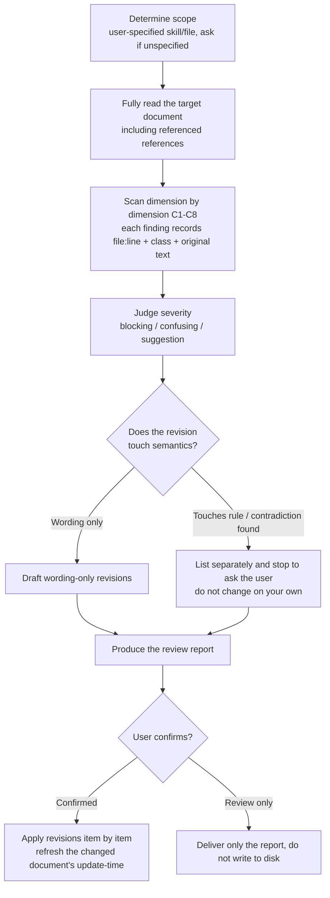

# Fibo Skills wording reviewer (fibo-skills-reviewer)

> **Positioning**: the **wording-quality cleaner** for distributed skill packages. It only optimizes "how to say it so the model isn't confused", **it does not change rule semantics**.
> **Applicable targets**: `SKILL.md`, `references/**/*.md`, `*.template.md`, `*.prompt.md`.
> **Self-checkable**: this skill itself is also within the review scope ("self-cleaning").

## Iron rules (read these three first)

1. **Only change wording, not semantics**: revisions are limited to wording, structure, disambiguation, removing asides. Any change that alters "what the rule does / where the boundary is" does not count as wording optimization — it must be listed separately and **stop to ask the user**.
2. **Do not pick a side on a contradiction**: when two rules/examples are found to clash, **report both conflicting sides + their respective locations**, and let the user decide which side to keep; changing one side on your own to make it "look consistent" is forbidden.
3. **Every finding must carry a location**: locate with `file path:line number` (following `fibo-conventions`' relative-path and jump-tag rules), so the user can verify item by item.

## Review dimensions (eight defect classes)

| Number | Defect class | Judgment points | Typical signals |
| --- | --- | --- | --- |
| C1 | Logical contradiction | Rule A clashes with rule B; body clashes with example; directory tree clashes with the naming/responsibility table | The same object is given a different name / status / path in two places |
| C2 | Logical gap | References an undefined state/branch/term; a flow has an entry but no exit; writes "must X" without stating the consequence of violation | Mentions a state that isn't in the flow diagram; a dangling `must`/`forbidden` |
| C3 | Insufficient consideration | Missing boundary/failure/null/concurrency/multiplicity branches | Only writes the happy path; "if conflict" has no follow-up |
| C4 | Meta-comment leak | An aside about the **document's own maintenance/history/version changes** is mixed into the operational-rule body | `(the template no longer embeds this diagram…)`, `key differences from the old rule`, `the user has migrated it out`, `(now uniformly changed to…)` |
| C5 | Obscure wording | A term has no explanation, a coined word, overly bookish/cutesy phrasing, an abbreviation appears first without expansion | Jargon only the author understands; non-plain expression |
| C6 | Unclear reference | `this`/`the above`/`as above`/`it` has no clear antecedent; relative-position references are easily misaligned | After editing the text above, the reference dangles |
| C7 | Redundancy drift | The same rule is stated in multiple places, so changing one place easily misses another | The naming rule is written once in the body and once in a table, with different wording |
| C8 | Placeholder/example pollution | A placeholder `{topic}` mixes into body text that must be copied verbatim, without a marker; an example is mistaken for a rule | The reader can't tell "fill in" from "copy verbatim" |

> C4 is a high-frequency item in this project: a maintenance note belongs in a commit message / CHANGELOG, not in the rule body meant for the model to execute. Scan this class first when reviewing.

## Review flow



**Step-by-step notes**:

1. **Determine scope**: if the user gave a skill name/file path, use it; when they only say "review the skill" without specifying a target, first list a candidate list for the user to circle, don't rewrite everything at once.
2. **Read the full text**: if the target `SKILL.md` dispatches to `references/`, read the relevant sub-documents in as well, otherwise cross-file contradictions (C1) will be missed.
3. **Scan the dimensions**: go through classes C1–C8 one by one, each finding recording `file:line`, the class number, the **original-text excerpt**, and a one-sentence problem statement.
4. **Judge severity**: `blocking` (will cause the model to execute wrongly, e.g. C1/C2) / `confusing` (understandable but easily misread, e.g. C4/C5/C6) / `suggestion` (readability improvement, e.g. C7/C8).
5. **Semantic gate**: before revising, ask yourself "will the rule's behavioral boundary change after the edit". If yes → put it into the stop-and-ask items; if no → draft the wording revision. The contradiction class (C1) always goes into the stop-and-ask items.
6. **Produce the report**: see the format below.
7. **Apply**: revise item by item only after the user confirms; for each document changed, refresh its trailing `update-time` per `fibo-conventions` (run the command to get the real system time), and finally scan the `AP-MD-*` in `references/anti-patterns.md`.

## Review report format

```
## Skills wording review report: <target>

### 1. Directly revisable (wording only, awaiting your confirmation)
| # | Location | Class | Problem | Suggested fix |
| - | ---- | ---- | ---- | ------- |
| 1 | references/conventions/docs-system.md:83 | C4 meta-comment leak | "(the template no longer embeds this diagram, this section is authoritative)" is a maintenance aside mixed into operational rules | Delete this parenthetical; if a trace is needed, move it into the commit message |

### 2. Needs your adjudication (touches semantics / logical contradiction, not changed on my own)
| # | Location | Class | Conflict/risk | Question to decide |
| - | ---- | ---- | -------- | ------- |
| 1 | a.md:12 ↔ b.md:34 | C1 contradiction | The two places give a different name to the same file | Which side is authoritative? |

### 3. Conclusion
- N directly revisable, M needing adjudication
- Suggested landing order: adjudicate the contradictions first, then batch-fix the wording
```

## Boundaries and forbidden zones

- **Do not touch rule semantics**: do not add/delete/relax rules, do not change the actual meaning of flow steps, do not touch AC, naming conventions, or state-machine judgment conditions — even if these "read awkwardly", only offer revision suggestions, do not change them on your own.
- **Do not touch frontmatter semantics**: the `name` at the top of `SKILL.md` is not changed; `description` is only suggested for optimization when its wording is obscure and the optimization does not change the trigger semantics, and it needs the user's confirmation.
- **Preserve structural markers**: the hard markers `fibo-conventions` depends on (such as the section name `## Sub-feature split` used for large-feature identification, the `?class=code/text/graph` tags, the meta-info-block fields) are contracts; changing them under the guise of "wording optimization" is forbidden.
- **An example is an example**: when revising example text, keep it a valid example; do not mistakenly upgrade an example into a new rule.
- **One scope at a time**: by default, focus on the one document / one set of documents the user specifies; a sweep across all skills requires the user's explicit request, produced as per-file reports and landed in batches.


---
name: Fibo Skills wording reviewer

update-time: 2026-09-08 04:56

description: A cleaner skill that reviews wording quality across distributed skill packages, scanning per the eight defect classes C1-C8 (logical contradiction/gap/insufficient consideration/meta-comment leak/obscure wording/unclear reference/redundancy drift/placeholder pollution) and producing a report, only changing wording not semantics, stopping on the contradiction class for the user to adjudicate

---
