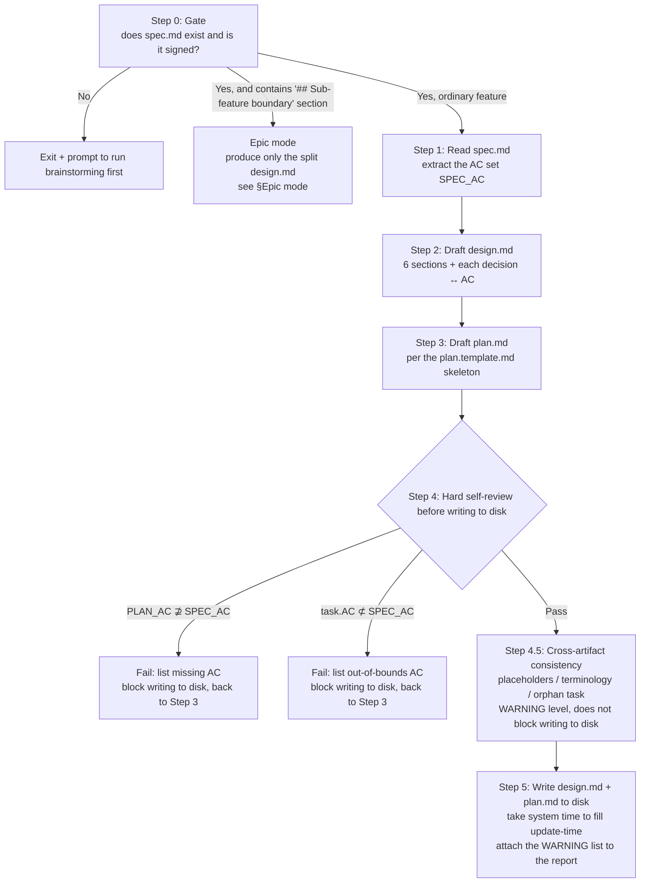
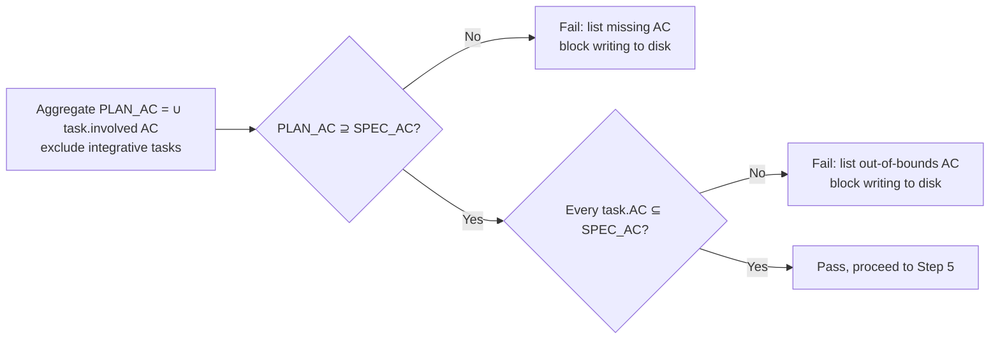
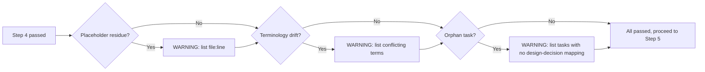
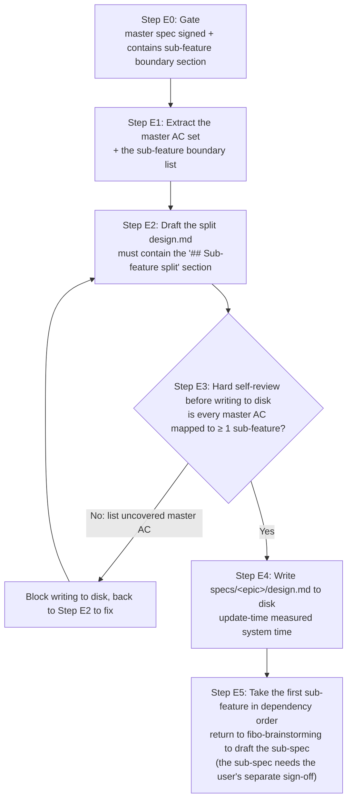
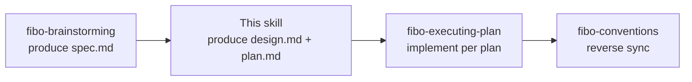

# Fibo writing-plan skill (writing-plan)

> This skill runs after spec.md is signed off and before any code is written.
> Input: `.fibo/docs/specs/<feature>/spec.md` (signed off)
> Output: `design.md` + `plan.md` in the same directory, serving as the input to `fibo-executing-plan`

---

## When to use

✅ Applicable:
- spec.md has been signed off via `fibo-brainstorming` (the meta-info block `update-time` is a real timestamp, not a `{...}` placeholder)
- Ready to enter the implementation stage, but "how to break down tasks / how to implement" is not yet decided
- spec.md is a **large-feature master spec** (contains a `## Sub-feature boundary` section) → run this skill's **Epic mode** (see §Epic mode): produce only the split design.md, not plan.md

❌ Not applicable:
- spec.md does not exist or is unsigned → run `fibo-brainstorming` first
- The same directory already has a valid `design.md` + `plan.md` → go directly to `fibo-executing-plan`
- Merely changing 1–2 AC of spec.md → re-run `fibo-brainstorming` Lightweight mode to change the spec, then come back to this skill to partially update design / plan

---

## Core principles

1. **No writing code, no touching files until just before writing to disk**: this skill only produces the two documents design.md + plan.md, touching no code
2. **AC coverage must be 100%**: every AC in spec.md must be covered by at least 1 task in plan.md; missing even one blocks writing to disk
3. **No out-of-bounds AC references allowed**: a task in plan.md cannot reference an AC number that does not exist in spec.md
4. **Every design decision must ↔ AC**: in design.md's "key design decisions" section, each entry must end with `↔ AC-NN`
5. **Meta-info block values measured for real**: the trailing meta-info block of design.md / plan.md must contain the three fields `name` / `update-time` / `description`; `update-time` must be measured for real with the `sync.md §2.2` cross-OS command, not from memory

---

## Main flow

---

## Step 0: Gate (whether spec.md is signed)

Read the trailing meta-info block of `.fibo/docs/specs/<feature>/spec.md`. Criteria for "signed off":
- The file exists
- The `update-time` field is in `YYYY-MM-DD HH:mm` format, **not** a `{...}` placeholder or empty

Unsigned → exit this skill and prompt the user to run `fibo-brainstorming` first.

---

## Step 1: Read spec.md and extract AC

Use a regex to extract all numbers of the form `AC-[A-Z0-9]+` (compatible with `AC-01` / `AC-A1` / `AC-B2` and other naming styles). Aggregate into the set `SPEC_AC = {AC-A1, AC-A2, ...}`.

Save each AC's title (`- **AC-XX**: ...`) as a mapping table, for reference in Steps 2 / 3, to avoid re-reading spec.md.

---

## Step 2: Draft design.md

Follow the 6-section structure of `fibo-conventions/references/design.template.md`:

1. **Goal** — one paragraph summarizing which spec AC this design implements
2. **Key design decisions** — one paragraph per decision, **each ending with `↔ AC-NN`** (one or more)
3. **File list** — a table listing "new / modified / untouched" files + purpose + corresponding AC
4. **Interface contract** — how skills / modules communicate (including a Mermaid call diagram)
5. **Interaction with existing modules** — a table listing affected existing modules + degree of impact
6. **Meta-info block** — `name` / `update-time` / `description` (`update-time` filled with system time)

**Mandatory**: every decision must carry `↔ AC-NN`; any decision paragraph without an AC attached is rejected from being written.

---

## Step 3: Draft plan.md

Follow the `references/plan.template.md` skeleton:

1. **AC coverage self-review table** (list it first, for reuse in Step 4)
2. **Task list**, each task containing 7 fields:
   - `task-id` (e.g. task-01)
   - Description
   - Involved AC (list; tasks marked "integrative" may fill in `-`)
   - Involved files (exact path / glob)
   - Acceptance method (specific command, e.g. `ls -la <path>` / `grep "x" <path>`)
   - Tags (`skill-doc` / `prod-code` / `config`, etc.)
   - Status (`[×]` not done / `[√]` done / `[!]` failed)
3. **Execution order** + **failure handling**

**Special allowance**: a task marked "integrative" (e.g. modifying an entry file, adding a README) may have empty involved AC, and does not participate in the AC coverage / out-of-bounds judgment.

---

## Step 4: Self-review before writing to disk (mandatory)

- On failure, **do not write any file to disk**; tell the user the missing / out-of-bounds list, go back to Step 3 to fix the plan, then re-run the self-review.

---

## Step 4.5: Cross-artifact consistency check (WARNING level, does not block writing to disk)

> Inspired by the cross-artifact checking idea of spec-kit's `/analyze` command, **but only produces WARNINGs and does not block writing to disk** — Step 4 has already blocked the hard errors that "must be fixed", like AC coverage / out-of-bounds; this step specializes in catching the soft issues that are "easy to miss, cheap to fix".

### 4.5.a Placeholder residue

Search the following strings across the three drafts `spec.md` / `design.md` / `plan.md`; a hit produces a WARNING:

- `TODO` / `FIXME` / `XXX`
- `???` / `<to fill>` / `<TBD>` / `TBD`
- Unreplaced brace placeholders like `{Feature display name}` / `{feature-slug}`

> WARNING line format after a hit: `WARN-P1: <file>:<line> residual placeholder "<text>"`

### 4.5.b Terminology drift

Extract key terms from spec.md (proper nouns / module names / config-item names appearing ≥ 2 times), and check whether the casing / hyphenation / Chinese-vs-English of references in design.md / plan.md matches spec.md. Examples:

- spec.md writes `commit-sync`, design.md writes `CommitSync` → WARN
- spec.md writes `reverse sync`, plan.md writes `backward sync` → WARN

> WARNING line format: `WARN-P2: term "<spec spelling>" is written as "<deviating spelling>" in <file>`

### 4.5.c Orphan task

Cross-reference each task's "involved files" in plan.md against design.md's "file list":

- If a task's involved file is **completely absent** from design.md's file list → this task may have no corresponding design decision → WARN
- Tasks marked "integrative" are exempt

> WARNING line format: `WARN-P3: task-NN <title> involved file <path> has no correspondence in design.md's file list`

### 4.5.d WARNING disposition

- WARNINGs **do not block writing to disk**; Step 5 proceeds normally
- **Attach the WARNING list** in the Step 5 report, letting the user decide "fix now / leave to the implementation stage / don't fix"
- With 0 WARNINGs, **silently let it through**; don't boast "all green" in the report

---

## Step 5: Write design.md + plan.md to disk

1. Run the cross-OS command to get the system time (see `fibo-conventions/references/conventions/sync.md` §2.2)
2. Fill the three fields `name` / `update-time` / `description` into the meta-info blocks of both drafts
3. Write `.fibo/docs/specs/<feature>/design.md`
4. Write `.fibo/docs/specs/<feature>/plan.md`
5. Report: both files are written to disk, `update-time` consistent; **if Step 4.5 has WARNINGs, attach the list** (list only if ≥ 1; with 0, silently let it through)
6. **Immediately auto-invoke the `fibo-executing-plan` skill**: implement serially in the task order of plan.md until all are `[√]`

> **Do not stop to ask "should we enter implementation"** — this skill's entry already implies "implementation" authorization (spec already signed = run the full chain). Only stop in the following cases: Step 4 self-review fails; the user explicitly calls a halt during the chaining.

---

## Epic mode (dedicated branch for a large-feature master spec)

> Trigger condition: the spec.md read in Step 0 contains a `## Sub-feature boundary` section (produced by `fibo-brainstorming` Step 0.5).
> Source of truth for directory structure and identification rules: `fibo-conventions/references/conventions/docs-system.md` §3.1.

**Difference from ordinary mode**: produce only `specs/<epic>/design.md` (the split design), **not plan.md**; the implementation-level design / plan all sink down to the sub-features.

**The `## Sub-feature split` section of the split design.md must contain 4 blocks**:

1. **Sub-feature list**: each item contains a directory name (lowercase hyphenated English) + a one-sentence responsibility boundary
2. **Dependency order**: the implementation precedence and rationale among sub-features (even with no dependencies, explicitly write "no dependencies, follow the list order")
3. **Master AC ↔ sub-feature mapping table**: which sub-feature(s) each master AC lands in; this is the input to the Step E3 self-review
4. **Status table**: one row per sub-feature, status values `[×]` not started / `[→]` in progress / `[√]` done; write back after the sub-feature chain completes

**Epic-mode iron rules**:

- ❌ Do not produce plan.md / diff.md under `specs/<epic>/`
- ❌ Do not write implementation details in the split design.md (file list / interface contract belong to the sub-feature design.md's responsibility)
- ❌ Do not auto-generate a sub-feature's spec.md — each sub-spec must go back to `fibo-brainstorming` to be signed off separately
- ❌ Do not directly chain to `fibo-executing-plan` (Epic mode has no plan.md to execute)
- ✅ After writing to disk, immediately enter the first sub-feature's brainstorming in dependency order, advancing only one sub-feature at a time

---

## Mandatory constraints

- ❌ Do not enter this skill while spec.md is unsigned
- ❌ Do not write code / run tests / commit
- ❌ Do not let any task reference an AC number that does not exist in spec.md
- ❌ Do not let any "key design decision" paragraph in design.md lack `↔ AC-NN`
- ❌ Do not fill `update-time` from memory (you must run the command)
- ❌ Do not force writing to disk when the self-review fails
- ✅ Allowed: show the design / plan draft as a code block in the dialogue for the user to review; write to disk only after the user signs off
- ✅ Allowed: tasks marked "integrative" may have empty involved AC (e.g. modifying the CLAUDE.md entry)

---

## Handoff to other skills

- **fibo-brainstorming**: the upstream of this skill (the Step 0 gate checks its deliverable)
- **fibo-executing-plan**: the downstream of this skill (consumes plan.md)
- **fibo-conventions**: when this skill writes design.md / plan.md to disk, follow its markdown / docs-system conventions

---
name: Fibo writing-plan skill

update-time: 2026-09-08 04:56

description: The flow for generating design.md and plan.md after spec.md is signed off, plus self-review, three-field meta-info, large-feature Epic mode (produces only the split design), and the convention for auto-entering the execution stage

---
